This document is the summary of the **Introduction to R** workshop. 

All correspondence related to this document should be addressed to: 

<center>
Omid Ghasemi (Macquarie University, Sydney, NSW, 2109, AUSTRALIA) 

Email: omidreza.ghasemi@hdr.mq.edu.au 
</center>


<style>

body{ /* Normal  */
      font-size: 18px;
      text-align: justify;
      line-height: 1.6;
      font-family: "Times New Roman", Times, serif;
}
code.r{ /* Code block */
    font-size: 14px;
}
pre { /* Code block - determines code spacing between lines */
    font-size: 12px;
}

</style>


# Research Question


The aim of the study is to test if simple arguments are more effective in belief revision than more complex arguments. To that end, we present participants with an imaginary scenario (two alien creatures on a planet) and a theory (one creature is predator and the other one is prey) and we ask them to rate the likelihood truth of the theory based on a simple fact (We adapted this method from Gregg et al.,2017; see the original study [here](https://journals.sagepub.com/doi/10.1080/17470218.2015.1099162)). Then, in a between-subject manipulation, participants will be presented with either 6 simple arguments (Modus Ponens conditionals) or 6 more complex arguments (Modus Tollens conditionals), and they will be asked to rate the likelihood truth of the initial theory on 7 stages. 

The first stage is the base rating stage. The next three stages include supportive arguments of the theory and the last three arguments include disproving arguments of the theory. We hypothesized that the group with simple arguments shows better persuasion (as it reflects in higher ratings for the supportive arguments) and better dissuasion (as it reflects in lower ratings for the opposing arguments).

In the last part of the study, participants will be asked to answer several cognitive capacity/style measures including thinking style (CRT), open-mindedness (AOT-E), reasoning ability (mindware), and numeracy scales. We hypothesized that cognitive ability, cognitive style, and open-mindedness are positive predictors of persuasion and dissuasion. These associations should be more pronounced for participants in the group with complex arguments because the ability and willingness to engage in deliberative thinking may favor participants to assess the underlying logical structure of those arguments. However, for participants in the simple group, the logical structure of arguments is more evident, so participants with lower ability can still assess the logical status of those arguments.
 


Thus, our hypotheses for this experiment are as follows:

- Participants in the group with simple arguments have higher ratings for supportive arguments (They are more easily persuaded than those in the group with complex arguments).

- Participants in the group with simple arguments have lower ratings for opposing arguments (They are more easily dissuaded than those in the group with complex arguments).

- There are significant associations between thinking style (CRT), open-mindedness (AOT-E), reasoning ability (mindware), and numeracy scales with both persuasion and dissuasion indexes in each group and in the entire sample. The relationship between these measures should be stronger, although not significantly, for participants in the group with complex arguments.


# Getting Ready

First, we need to design the experiment. For this experiment, we use online platforms for data collection. There are several options such as Gorilla, JSpsych, Qualtrics, psychoJS (pavlovia), etc. Since we do not need any reaction time data, we simply use Qualtrics. For an overview of different lab-based and online platforms, see [here](https://omidghasemi21.github.io/human_data/Scripts/behavioral_data.html). 

Next, we need to decide on the number of participants (sample size). For this study, we do not sue power analysis since we cannot access more than 120 participants. However, it is highly suggested calculate sample size using power estimation. You can find some nice tutorials on how to do that [here](https://julianquandt.com/post/power-analysis-by-data-simulation-in-r-part-i/), [here](https://nickch-k.github.io/EconometricsSlides/Week_08/Power_Simulations.html), and [here](https://cran.r-project.org/web/packages/paramtest/vignettes/Simulating-Power.html).

After we created the experiment and decided on the sample size, the next step is to preresigter the study. However, it would be better to do a pilot with 4 or 5 participants, clean all the data, do the desired analysis, and then pre-register the analysis and those codes. You can find the preregistration form for the current study [here](https://osf.io/79r6e).

Finally, we need to restructure our project in a tidy folder with different sub-folders. Having a clean and tidy folder structure can save us! There are different formats of folder structure (for example, see [here](http://nikola.me/folder_structure.html) and [here](https://slides.com/djnavarro/workflow)), but for now, we use the following structure:


# Introduction to R

```r
# load libraries
library(tidyverse)
library(here)
library(janitor)
library(broom)
library(afex)
library(emmeans)
library(knitr)
library(kableExtra)
library(ggsci)
library(patchwork)
library(skimr)
# install.packages("devtools")
# devtools::install_github("easystats/correlation")
library("correlation")
options(scipen=999) # turn off scientific notations
options(contrasts = c('contr.sum','contr.poly')) # set the contrast sum globally 
options(knitr.kable.NA = '')
```


<div class="figure" style="text-align: center">

<p class="caption">Artwork by Allison Horst: https://github.com/allisonhorst/stats-illustrations</p>
</div>


R can be used as a calculator. For mathematical purposes, be careful of the order in which R executes the commands.


```r
10 + 10
```

```
## [1] 20
```

```r
4 ^ 2
```

```
## [1] 16
```

```r
(250 / 500) * 100
```

```
## [1] 50
```

R is a bit flexible with spacing (but no spacing in the name of variables and words)


```r
10+10
```

```
## [1] 20
```

```r
10                 +           10
```

```
## [1] 20
```

R can sometimes tell that you're not finished yet


```r
10 +
```

How to create a *variable*? Variable assignment using `<-` and `=`. Note that R is case sensitive for everything


```r
pay <- 250

month = 12

pay * month
```

```
## [1] 3000
```

```r
salary <- pay * month
```


Few points in naming variables and vectors: use short, informative words, keep same method (e.g., not using capital words, use only _ or . ).

## Function 
Function is a set of statements combined together to perform a specific task. When we use a block of code repeatedly, we can convert it to a function. To write a function, first, you need to *define* it:


```r
my_multiplier <- function(a,b){
  result = a * b
  return (result)
}
```

This code do nothing. To get a result, you need to *call* it:


```r
my_multiplier (a=2, b=4)
```

```
## [1] 8
```

```r
# or: my_multiplier (2, 4)
```

We can set a default value for our arguments:


```r
my_multiplier2 <- function(a,b=4){
  result = a * b
  return (result)
}

my_multiplier2 (a=2)
```

```
## [1] 8
```

```r
# or: my_multiplier (2)
# or: my_multiplier (2, 6)
```

Fortunately, you do not need to write everything from scratch. R has lots of built-in functions that you can use:

```r
round(54.6787)
```

```
## [1] 55
```

```r
round(54.5787, digits = 2)
```

```
## [1] 54.58
```

Use `?` before the function name to get some help. For example, `?round`. You will see many functions in the rest of the workshop.

## Basic Data Types in R:

function `class()` is used to show what is the type of a variable.


1. *Logical*: `TRUE`, `FALSE` can be abbreviated as `T`, `F`.  They has to be capital, 'true' is not a logical data:

```r
class(TRUE)
```

```
## [1] "logical"
```

```r
class(F)
```

```
## [1] "logical"
```

2. *Numeric*: all numbers e.g. 5,  10.5,  11,37;  a special type of numeric is "integer" which is numbers without decimal. Integers are always numeric, but numeric is not always integer:

```r
class(2)
```

```
## [1] "numeric"
```

```r
class(13.46)
```

```
## [1] "numeric"
```

3. *Character*: text for example, "I love R" or "4" or "4.5":

```r
class("ha ha ha ha")
```

```
## [1] "character"
```

```r
class("56.6")
```

```
## [1] "character"
```

```r
class("TRUE")
```

```
## [1] "character"
```

Can we change the type of data in a variable? Yes, you need to use the function `as.---()`


```r
as.numeric(TRUE)
```

```
## [1] 1
```

```r
as.character(4)
```

```
## [1] "4"
```

```r
as.numeric("4.5")
```

```
## [1] 4.5
```

```r
as.numeric("Hello")
```

```
## Warning: NAs introduced by coercion
```

```
## [1] NA
```


## Data Structures in R


**Vector**: when there are more than one number or letter stored. Use the combine function c() for that.


```r
sale <- c(1, 2, 3,4, 5, 6, 7, 8, 9, 10) # also sale <- c(1:10)

sale <- c(1:10)

sale * sale
```

```
##  [1]   1   4   9  16  25  36  49  64  81 100
```

*Subsetting a vector*:


```r
days <- c("Saturday", "Sunday", "Monday", "Tuesday", "Wednesday", "Thursday", "Friday")

days[2]
```

```
## [1] "Sunday"
```

```r
days[-2]
```

```
## [1] "Saturday"  "Monday"    "Tuesday"   "Wednesday" "Thursday"  "Friday"
```

```r
days[c(2, 3, 4)]
```

```
## [1] "Sunday"  "Monday"  "Tuesday"
```


### Exercise

Create a vector named `my_vector` with numbers from 0 to 1000 in it:


```r
my_vector <- (0:1000)

mean(my_vector)
```

```
## [1] 500
```

```r
median(my_vector)
```

```
## [1] 500
```

```r
min(my_vector)
```

```
## [1] 0
```

```r
range(my_vector)
```

```
## [1]    0 1000
```

```r
class(my_vector)
```

```
## [1] "integer"
```

```r
sum(my_vector)
```

```
## [1] 500500
```

```r
sd(my_vector)
```

```
## [1] 289.1081
```

**List**: allows you to gather a variety of objects under one name (that is, the name of the list) in an ordered way. These objects can be matrices, vectors, data frames, even other list.


```r
my_list = list(sale, 1, 3, 4:7, "HELLO", "hello", FALSE)
my_list
```

```
## [[1]]
##  [1]  1  2  3  4  5  6  7  8  9 10
## 
## [[2]]
## [1] 1
## 
## [[3]]
## [1] 3
## 
## [[4]]
## [1] 4 5 6 7
## 
## [[5]]
## [1] "HELLO"
## 
## [[6]]
## [1] "hello"
## 
## [[7]]
## [1] FALSE
```

**Factor**: Factors store the vector along with the distinct values of the elements in the vector as labels. The labels are always character irrespective of whether it is numeric or character. For example, variable gender with "male" and "female" entries:


```r
gender <- c("male", "male", "male", " female", "female", "female")
gender <- factor(gender)
```

R now treats gender as a nominal (categorical) variable: 1=female, 2=male internally (alphabetically).

```r
summary(gender)
```

```
##  female  female    male 
##       1       2       3
```

*Question*: why when we ran the above function i.e. summary(), it showed three and not two levels of the data? *Hint*: run 'gender'.


```r
gender
```

```
## [1] male    male    male     female female  female 
## Levels:  female female male
```

So, be careful of spaces!

### Exercise
Create a gender factor with 30 male and 40 females (*Hint*: use the `rep()` function):

```r
gender <- c(rep("male",30), rep("female", 40))
gender <- factor(gender)
gender
```

```
##  [1] male   male   male   male   male   male   male   male   male   male  
## [11] male   male   male   male   male   male   male   male   male   male  
## [21] male   male   male   male   male   male   male   male   male   male  
## [31] female female female female female female female female female female
## [41] female female female female female female female female female female
## [51] female female female female female female female female female female
## [61] female female female female female female female female female female
## Levels: female male
```

There are two types of categorical variables: nominal and ordinal. How to create ordered factors (when the variable is nominal and values can be ordered)? We should add two additional arguments to the `factor()` function: `ordered = TRUE`, and `levels = c("level1", "level2")`. For example, we have a vector that shows participants' education level.


```r
edu<-c(3,2,3,4,1,2,2,3,4)

education<-factor(edu, ordered = TRUE)
levels(education) <- c("Primary school","high school","College","Uni graduated")
education
```

```
## [1] College        high school    College        Uni graduated 
## [5] Primary school high school    high school    College       
## [9] Uni graduated 
## Levels: Primary school < high school < College < Uni graduated
```

### Exercise
We have a factor with `patient` and `control` values. Here, the first level is control and the second level is patient. Change the order of levels, so patient would be the first level:


```r
health_status <- factor(c(rep('patient',5),rep('control',5)))
health_status
```

```
##  [1] patient patient patient patient patient control control control
##  [9] control control
## Levels: control patient
```

```r
health_status_reordered <- factor(health_status, levels = c('patient','control'))
health_status_reordered
```

```
##  [1] patient patient patient patient patient control control control
##  [9] control control
## Levels: patient control
```

Finally, can you relabel both levels to uppercase characters? (*Hint*: check `?factor`)


```r
health_status_relabeled <- factor(health_status, levels = c('patient','control'), labels = c('Patient','Control'))
health_status_relabeled
```

```
##  [1] Patient Patient Patient Patient Patient Control Control Control
##  [9] Control Control
## Levels: Patient Control
```


**Matrices**: All columns in a matrix must have the same mode(numeric, character, etc.) and the same length. It can be created using a vector input to the matrix function.


```r
my_matrix = matrix(c(1,2,3,4,5,6,7,8,9), nrow = 3, ncol = 3)

my_matrix
```

```
##      [,1] [,2] [,3]
## [1,]    1    4    7
## [2,]    2    5    8
## [3,]    3    6    9
```

**Data frames**: (two-dimensional objects) can hold numeric, character or logical values. Within a column all elements have the same data type, but different columns can be of different data type. Let's create a dataframe:


```r
id <- 1:200
group <- c(rep("Psychotherapy", 100), rep("Medication", 100))
response <- c(rnorm(100, mean = 30, sd = 5),
             rnorm(100, mean = 25, sd = 5))

my_dataframe <-data.frame(Patient = id,
                          Treatment = group,
                          Response = response)
```

We also could have done the below


```r
my_dataframe <-data.frame(Patient = c(1:200),
                          Treatment = c(rep("Psychotherapy", 100), rep("Medication", 100)),
                          Response = c(rnorm(100, mean = 30, sd = 5),
                                       rnorm(100, mean = 25, sd = 5)))
```

In large data sets, the function head() enables you to show the first observations of a data frames. Similarly, the function tail() prints out the last observations in your data set.


```r
head(my_dataframe) 
tail(my_dataframe)
```

<table class="table table-striped table-bordered table-condensed" style="margin-left: auto; margin-right: auto;">
 <thead>
  <tr>
   <th style="text-align:right;position: sticky; top:0; background-color: #FFFFFF;"> Patient </th>
   <th style="text-align:left;position: sticky; top:0; background-color: #FFFFFF;"> Treatment </th>
   <th style="text-align:right;position: sticky; top:0; background-color: #FFFFFF;"> Response </th>
  </tr>
 </thead>
<tbody>
  <tr>
   <td style="text-align:right;"> 1 </td>
   <td style="text-align:left;"> Psychotherapy </td>
   <td style="text-align:right;"> 31.46027 </td>
  </tr>
  <tr>
   <td style="text-align:right;"> 2 </td>
   <td style="text-align:left;"> Psychotherapy </td>
   <td style="text-align:right;"> 25.80691 </td>
  </tr>
  <tr>
   <td style="text-align:right;"> 3 </td>
   <td style="text-align:left;"> Psychotherapy </td>
   <td style="text-align:right;"> 23.90582 </td>
  </tr>
  <tr>
   <td style="text-align:right;"> 4 </td>
   <td style="text-align:left;"> Psychotherapy </td>
   <td style="text-align:right;"> 35.24277 </td>
  </tr>
  <tr>
   <td style="text-align:right;"> 5 </td>
   <td style="text-align:left;"> Psychotherapy </td>
   <td style="text-align:right;"> 36.12894 </td>
  </tr>
  <tr>
   <td style="text-align:right;"> 6 </td>
   <td style="text-align:left;"> Psychotherapy </td>
   <td style="text-align:right;"> 28.88709 </td>
  </tr>
</tbody>
</table>

<table class="table table-striped table-bordered table-condensed" style="margin-left: auto; margin-right: auto;">
 <thead>
  <tr>
   <th style="text-align:left;position: sticky; top:0; background-color: #FFFFFF;">   </th>
   <th style="text-align:right;position: sticky; top:0; background-color: #FFFFFF;"> Patient </th>
   <th style="text-align:left;position: sticky; top:0; background-color: #FFFFFF;"> Treatment </th>
   <th style="text-align:right;position: sticky; top:0; background-color: #FFFFFF;"> Response </th>
  </tr>
 </thead>
<tbody>
  <tr>
   <td style="text-align:left;"> 195 </td>
   <td style="text-align:right;"> 195 </td>
   <td style="text-align:left;"> Medication </td>
   <td style="text-align:right;"> 29.98481 </td>
  </tr>
  <tr>
   <td style="text-align:left;"> 196 </td>
   <td style="text-align:right;"> 196 </td>
   <td style="text-align:left;"> Medication </td>
   <td style="text-align:right;"> 17.56606 </td>
  </tr>
  <tr>
   <td style="text-align:left;"> 197 </td>
   <td style="text-align:right;"> 197 </td>
   <td style="text-align:left;"> Medication </td>
   <td style="text-align:right;"> 27.15201 </td>
  </tr>
  <tr>
   <td style="text-align:left;"> 198 </td>
   <td style="text-align:right;"> 198 </td>
   <td style="text-align:left;"> Medication </td>
   <td style="text-align:right;"> 25.47396 </td>
  </tr>
  <tr>
   <td style="text-align:left;"> 199 </td>
   <td style="text-align:right;"> 199 </td>
   <td style="text-align:left;"> Medication </td>
   <td style="text-align:right;"> 25.41576 </td>
  </tr>
  <tr>
   <td style="text-align:left;"> 200 </td>
   <td style="text-align:right;"> 200 </td>
   <td style="text-align:left;"> Medication </td>
   <td style="text-align:right;"> 26.85049 </td>
  </tr>
</tbody>
</table>

Similar to vectors and matrices, brackets [] are used to selects data from rows and columns in data.frames:


```r
my_dataframe[35, 3]
```

```
## [1] 24.10207
```

### Exercise

How can we get all columns, but only for the first 10 participants?


```r
my_dataframe[1:10, ]
```

<table class="table table-striped table-bordered table-condensed" style="margin-left: auto; margin-right: auto;">
 <thead>
  <tr>
   <th style="text-align:right;position: sticky; top:0; background-color: #FFFFFF;"> Patient </th>
   <th style="text-align:left;position: sticky; top:0; background-color: #FFFFFF;"> Treatment </th>
   <th style="text-align:right;position: sticky; top:0; background-color: #FFFFFF;"> Response </th>
  </tr>
 </thead>
<tbody>
  <tr>
   <td style="text-align:right;"> 1 </td>
   <td style="text-align:left;"> Psychotherapy </td>
   <td style="text-align:right;"> 31.46027 </td>
  </tr>
  <tr>
   <td style="text-align:right;"> 2 </td>
   <td style="text-align:left;"> Psychotherapy </td>
   <td style="text-align:right;"> 25.80691 </td>
  </tr>
  <tr>
   <td style="text-align:right;"> 3 </td>
   <td style="text-align:left;"> Psychotherapy </td>
   <td style="text-align:right;"> 23.90582 </td>
  </tr>
  <tr>
   <td style="text-align:right;"> 4 </td>
   <td style="text-align:left;"> Psychotherapy </td>
   <td style="text-align:right;"> 35.24277 </td>
  </tr>
  <tr>
   <td style="text-align:right;"> 5 </td>
   <td style="text-align:left;"> Psychotherapy </td>
   <td style="text-align:right;"> 36.12894 </td>
  </tr>
  <tr>
   <td style="text-align:right;"> 6 </td>
   <td style="text-align:left;"> Psychotherapy </td>
   <td style="text-align:right;"> 28.88709 </td>
  </tr>
  <tr>
   <td style="text-align:right;"> 7 </td>
   <td style="text-align:left;"> Psychotherapy </td>
   <td style="text-align:right;"> 28.13632 </td>
  </tr>
  <tr>
   <td style="text-align:right;"> 8 </td>
   <td style="text-align:left;"> Psychotherapy </td>
   <td style="text-align:right;"> 26.74151 </td>
  </tr>
  <tr>
   <td style="text-align:right;"> 9 </td>
   <td style="text-align:left;"> Psychotherapy </td>
   <td style="text-align:right;"> 28.07995 </td>
  </tr>
  <tr>
   <td style="text-align:right;"> 10 </td>
   <td style="text-align:left;"> Psychotherapy </td>
   <td style="text-align:right;"> 25.66144 </td>
  </tr>
</tbody>
</table>
How to get only the Response column for all participants?


```r
my_dataframe[ , 3]
```

```
##   [1] 31.46027 25.80691 23.90582 35.24277 36.12894 28.88709 28.13632
##   [8] 26.74151 28.07995 25.66144 32.43043 32.90031 28.22010 20.49055
##  [15] 21.60086 29.88247 28.37732 28.33941 32.99115 35.60892 28.20174
##  [22] 31.02228 37.67104 26.73629 23.17044 29.62874 27.47495 29.36538
##  [29] 36.66284 37.21628 33.22692 28.58497 29.40086 30.05996 24.10207
##  [36] 37.68405 34.11073 35.26914 35.77968 23.37928 29.54027 26.18844
##  [43] 38.75336 29.88913 35.19795 32.72946 29.27546 31.04248 33.29102
##  [50] 18.01849 29.91320 30.06106 30.93769 29.09398 31.92382 31.01322
##  [57] 26.27603 28.00506 29.75021 32.14493 24.69866 31.15726 22.59687
##  [64] 33.51499 20.87766 24.72480 28.88959 23.23752 22.79437 25.97967
##  [71] 40.90827 30.38728 38.08255 37.16809 25.73616 25.32099 28.77482
##  [78] 34.21075 33.13974 29.55064 23.93372 30.95174 28.30632 37.92416
##  [85] 27.14505 19.64008 34.20583 44.02146 29.18339 35.25485 39.78779
##  [92] 32.02400 33.92133 31.74780 22.73999 31.02149 24.51421 28.80851
##  [99] 37.00935 39.01414 24.46241 33.60924 26.14423 19.96034 24.18702
## [106] 25.42803 26.15863 29.76837 25.03232 25.53612 26.98493 23.44438
## [113] 14.90449 28.02894 24.57431 22.30127 34.10020 20.91610 33.11796
## [120] 37.12811 22.89906 31.94684 27.52520 22.31867 13.92906 19.25865
## [127] 30.37195 24.67580 26.37599 24.65865 28.30528 23.66096 17.49513
## [134] 23.04172 15.84645 18.23439 26.63121 29.81582 32.55382 25.66231
## [141] 28.64869 23.77102 32.00628 25.16474 32.48781 25.98615 22.57022
## [148] 19.36977 28.48540 26.29446 21.81714 24.45360 17.95169 23.09270
## [155] 21.38275 27.08464 18.66920 27.60698 27.70646 24.17864 22.87044
## [162] 24.70419 19.10310 21.52611 25.94191 26.26336 27.21419 26.85767
## [169] 17.14670 24.41177 31.19198 24.97077 24.81557 21.71635 26.72816
## [176] 24.91654 28.13910 21.55515 19.29760 26.87387 23.21848 26.19222
## [183] 25.00059 33.82250 27.32508 35.48514 32.61955 32.35353 10.76799
## [190] 15.55515 23.96873 23.10777 26.09092 21.18117 29.98481 17.56606
## [197] 27.15201 25.47396 25.41576 26.85049
```

Another easier way for selecting particular items is using their names that is more helpful than number of the rows in large data sets:

```r
my_dataframe[ , "Response"]
# OR:
my_dataframe$Response
```


# Data Cleaning

<div class="figure" style="text-align: center">

<p class="caption">Artwork by Allison Horst: https://github.com/allisonhorst/stats-illustrations</p>
</div>


<div class="figure" style="text-align: center">

<p class="caption">Artwork by Allison Horst: https://github.com/allisonhorst/stats-illustrations</p>
</div>

Now, suppose we tested 141 students. First, let's read and check the uncleaned data:

```r
# read the raw data
raw_data <- read_csv(here("raw_data","raw_data_exp1.csv"))
head(raw_data)
```

<div style="border: 1px solid #ddd; padding: 5px; overflow-x: scroll; width:780px; "><table class="table table-striped table-bordered table-condensed" style="width: auto !important; margin-left: auto; margin-right: auto;">
 <thead>
  <tr>
   <th style="text-align:left;position: sticky; top:0; background-color: #FFFFFF;"> end_date </th>
   <th style="text-align:left;position: sticky; top:0; background-color: #FFFFFF;"> status </th>
   <th style="text-align:left;position: sticky; top:0; background-color: #FFFFFF;"> ip_address </th>
   <th style="text-align:right;position: sticky; top:0; background-color: #FFFFFF;"> progress </th>
   <th style="text-align:right;position: sticky; top:0; background-color: #FFFFFF;"> duration_in_seconds </th>
   <th style="text-align:left;position: sticky; top:0; background-color: #FFFFFF;"> subject </th>
   <th style="text-align:left;position: sticky; top:0; background-color: #FFFFFF;"> recorded_date </th>
   <th style="text-align:left;position: sticky; top:0; background-color: #FFFFFF;"> response_id </th>
   <th style="text-align:right;position: sticky; top:0; background-color: #FFFFFF;"> location_latitude </th>
   <th style="text-align:right;position: sticky; top:0; background-color: #FFFFFF;"> location_longitude </th>
   <th style="text-align:left;position: sticky; top:0; background-color: #FFFFFF;"> distribution_channel </th>
   <th style="text-align:left;position: sticky; top:0; background-color: #FFFFFF;"> user_language </th>
   <th style="text-align:left;position: sticky; top:0; background-color: #FFFFFF;"> consent_form </th>
   <th style="text-align:right;position: sticky; top:0; background-color: #FFFFFF;"> age </th>
   <th style="text-align:left;position: sticky; top:0; background-color: #FFFFFF;"> gender </th>
   <th style="text-align:right;position: sticky; top:0; background-color: #FFFFFF;"> stage1_simple </th>
   <th style="text-align:right;position: sticky; top:0; background-color: #FFFFFF;"> stage2_simple </th>
   <th style="text-align:right;position: sticky; top:0; background-color: #FFFFFF;"> stage3_simple </th>
   <th style="text-align:right;position: sticky; top:0; background-color: #FFFFFF;"> stage4_simple </th>
   <th style="text-align:right;position: sticky; top:0; background-color: #FFFFFF;"> stage5_simple </th>
   <th style="text-align:right;position: sticky; top:0; background-color: #FFFFFF;"> stage6_simple </th>
   <th style="text-align:right;position: sticky; top:0; background-color: #FFFFFF;"> stage7_simple </th>
   <th style="text-align:right;position: sticky; top:0; background-color: #FFFFFF;"> stage1_complex </th>
   <th style="text-align:right;position: sticky; top:0; background-color: #FFFFFF;"> stage2_complex </th>
   <th style="text-align:right;position: sticky; top:0; background-color: #FFFFFF;"> stage3_complex </th>
   <th style="text-align:right;position: sticky; top:0; background-color: #FFFFFF;"> stage4_complex </th>
   <th style="text-align:right;position: sticky; top:0; background-color: #FFFFFF;"> stage5_complex </th>
   <th style="text-align:right;position: sticky; top:0; background-color: #FFFFFF;"> stage6_complex </th>
   <th style="text-align:right;position: sticky; top:0; background-color: #FFFFFF;"> stage7_complex </th>
   <th style="text-align:right;position: sticky; top:0; background-color: #FFFFFF;"> thinking1 </th>
   <th style="text-align:right;position: sticky; top:0; background-color: #FFFFFF;"> thinking2 </th>
   <th style="text-align:right;position: sticky; top:0; background-color: #FFFFFF;"> thinking3 </th>
   <th style="text-align:right;position: sticky; top:0; background-color: #FFFFFF;"> openminded1 </th>
   <th style="text-align:right;position: sticky; top:0; background-color: #FFFFFF;"> openminded2 </th>
   <th style="text-align:right;position: sticky; top:0; background-color: #FFFFFF;"> openminded3 </th>
   <th style="text-align:right;position: sticky; top:0; background-color: #FFFFFF;"> openminded4 </th>
   <th style="text-align:right;position: sticky; top:0; background-color: #FFFFFF;"> openminded5 </th>
   <th style="text-align:right;position: sticky; top:0; background-color: #FFFFFF;"> openminded6 </th>
   <th style="text-align:right;position: sticky; top:0; background-color: #FFFFFF;"> openminded7 </th>
   <th style="text-align:right;position: sticky; top:0; background-color: #FFFFFF;"> openminded8 </th>
   <th style="text-align:left;position: sticky; top:0; background-color: #FFFFFF;"> group </th>
   <th style="text-align:right;position: sticky; top:0; background-color: #FFFFFF;"> numeracy_total </th>
   <th style="text-align:right;position: sticky; top:0; background-color: #FFFFFF;"> reasoning_total </th>
  </tr>
 </thead>
<tbody>
  <tr>
   <td style="text-align:left;"> 24/9/20 22:02 </td>
   <td style="text-align:left;"> IP Address </td>
   <td style="text-align:left;"> 202.7.193.64 </td>
   <td style="text-align:right;"> 100 </td>
   <td style="text-align:right;"> 1517 </td>
   <td style="text-align:left;"> subj1 </td>
   <td style="text-align:left;"> 24/9/20 22:02 </td>
   <td style="text-align:left;"> R_1f298znjmVzcOjp </td>
   <td style="text-align:right;"> -33.85910 </td>
   <td style="text-align:right;"> 151.2002 </td>
   <td style="text-align:left;"> anonymous </td>
   <td style="text-align:left;"> EN </td>
   <td style="text-align:left;"> I consent </td>
   <td style="text-align:right;"> 18 </td>
   <td style="text-align:left;"> Female </td>
   <td style="text-align:right;">  </td>
   <td style="text-align:right;">  </td>
   <td style="text-align:right;">  </td>
   <td style="text-align:right;">  </td>
   <td style="text-align:right;">  </td>
   <td style="text-align:right;">  </td>
   <td style="text-align:right;">  </td>
   <td style="text-align:right;"> 36 </td>
   <td style="text-align:right;"> 70 </td>
   <td style="text-align:right;"> 68 </td>
   <td style="text-align:right;"> 54 </td>
   <td style="text-align:right;"> 51 </td>
   <td style="text-align:right;"> 43 </td>
   <td style="text-align:right;"> 41 </td>
   <td style="text-align:right;"> 8 </td>
   <td style="text-align:right;"> 50 </td>
   <td style="text-align:right;"> 20 </td>
   <td style="text-align:right;"> 5 </td>
   <td style="text-align:right;"> 5 </td>
   <td style="text-align:right;"> 5 </td>
   <td style="text-align:right;"> 5 </td>
   <td style="text-align:right;"> 5 </td>
   <td style="text-align:right;"> 6 </td>
   <td style="text-align:right;"> 5 </td>
   <td style="text-align:right;"> 3 </td>
   <td style="text-align:left;"> Complex </td>
   <td style="text-align:right;"> 9 </td>
   <td style="text-align:right;"> 9 </td>
  </tr>
  <tr>
   <td style="text-align:left;"> 25/9/20 3:23 </td>
   <td style="text-align:left;"> IP Address </td>
   <td style="text-align:left;"> 220.245.220.94 </td>
   <td style="text-align:right;"> 100 </td>
   <td style="text-align:right;"> 1131 </td>
   <td style="text-align:left;"> subj2 </td>
   <td style="text-align:left;"> 25/9/20 3:23 </td>
   <td style="text-align:left;"> R_tL0A9P33Gi18I0N </td>
   <td style="text-align:right;"> -34.03680 </td>
   <td style="text-align:right;"> 150.6672 </td>
   <td style="text-align:left;"> anonymous </td>
   <td style="text-align:left;"> EN </td>
   <td style="text-align:left;"> I consent </td>
   <td style="text-align:right;"> 18 </td>
   <td style="text-align:left;"> Male </td>
   <td style="text-align:right;"> 50 </td>
   <td style="text-align:right;"> 55 </td>
   <td style="text-align:right;"> 55 </td>
   <td style="text-align:right;"> 90 </td>
   <td style="text-align:right;"> 75 </td>
   <td style="text-align:right;"> 50 </td>
   <td style="text-align:right;"> 35 </td>
   <td style="text-align:right;">  </td>
   <td style="text-align:right;">  </td>
   <td style="text-align:right;">  </td>
   <td style="text-align:right;">  </td>
   <td style="text-align:right;">  </td>
   <td style="text-align:right;">  </td>
   <td style="text-align:right;">  </td>
   <td style="text-align:right;"> 8 </td>
   <td style="text-align:right;"> 10 </td>
   <td style="text-align:right;"> 39 </td>
   <td style="text-align:right;"> 6 </td>
   <td style="text-align:right;"> 6 </td>
   <td style="text-align:right;"> 6 </td>
   <td style="text-align:right;"> 5 </td>
   <td style="text-align:right;"> 6 </td>
   <td style="text-align:right;"> 6 </td>
   <td style="text-align:right;"> 5 </td>
   <td style="text-align:right;"> 6 </td>
   <td style="text-align:left;"> Simple </td>
   <td style="text-align:right;"> 9 </td>
   <td style="text-align:right;"> 10 </td>
  </tr>
  <tr>
   <td style="text-align:left;"> 27/9/20 22:59 </td>
   <td style="text-align:left;"> IP Address </td>
   <td style="text-align:left;"> 121.210.0.211 </td>
   <td style="text-align:right;"> 100 </td>
   <td style="text-align:right;"> 709 </td>
   <td style="text-align:left;"> subj3 </td>
   <td style="text-align:left;"> 27/9/20 22:59 </td>
   <td style="text-align:left;"> R_1LNyJhCKxTAAMOW </td>
   <td style="text-align:right;"> -33.85910 </td>
   <td style="text-align:right;"> 151.2002 </td>
   <td style="text-align:left;"> anonymous </td>
   <td style="text-align:left;"> EN </td>
   <td style="text-align:left;"> I consent </td>
   <td style="text-align:right;"> 19 </td>
   <td style="text-align:left;"> Female </td>
   <td style="text-align:right;"> 50 </td>
   <td style="text-align:right;"> 50 </td>
   <td style="text-align:right;"> 77 </td>
   <td style="text-align:right;"> 60 </td>
   <td style="text-align:right;"> 25 </td>
   <td style="text-align:right;"> 20 </td>
   <td style="text-align:right;"> 13 </td>
   <td style="text-align:right;">  </td>
   <td style="text-align:right;">  </td>
   <td style="text-align:right;">  </td>
   <td style="text-align:right;">  </td>
   <td style="text-align:right;">  </td>
   <td style="text-align:right;">  </td>
   <td style="text-align:right;">  </td>
   <td style="text-align:right;"> 8 </td>
   <td style="text-align:right;"> 50 </td>
   <td style="text-align:right;"> 20 </td>
   <td style="text-align:right;"> 6 </td>
   <td style="text-align:right;"> 5 </td>
   <td style="text-align:right;"> 4 </td>
   <td style="text-align:right;"> 5 </td>
   <td style="text-align:right;"> 5 </td>
   <td style="text-align:right;"> 6 </td>
   <td style="text-align:right;"> 5 </td>
   <td style="text-align:right;"> 6 </td>
   <td style="text-align:left;"> Simple </td>
   <td style="text-align:right;"> 10 </td>
   <td style="text-align:right;"> 8 </td>
  </tr>
  <tr>
   <td style="text-align:left;"> 27/9/20 23:18 </td>
   <td style="text-align:left;"> IP Address </td>
   <td style="text-align:left;"> 58.179.100.109 </td>
   <td style="text-align:right;"> 100 </td>
   <td style="text-align:right;"> 949 </td>
   <td style="text-align:left;"> subj4 </td>
   <td style="text-align:left;"> 27/9/20 23:18 </td>
   <td style="text-align:left;"> R_3enxzUsEYgs5r1a </td>
   <td style="text-align:right;"> -12.63921 </td>
   <td style="text-align:right;"> 141.8741 </td>
   <td style="text-align:left;"> anonymous </td>
   <td style="text-align:left;"> EN </td>
   <td style="text-align:left;"> I consent </td>
   <td style="text-align:right;"> 27 </td>
   <td style="text-align:left;"> Female </td>
   <td style="text-align:right;">  </td>
   <td style="text-align:right;">  </td>
   <td style="text-align:right;">  </td>
   <td style="text-align:right;">  </td>
   <td style="text-align:right;">  </td>
   <td style="text-align:right;">  </td>
   <td style="text-align:right;">  </td>
   <td style="text-align:right;"> 70 </td>
   <td style="text-align:right;"> 80 </td>
   <td style="text-align:right;"> 90 </td>
   <td style="text-align:right;"> 95 </td>
   <td style="text-align:right;"> 70 </td>
   <td style="text-align:right;"> 80 </td>
   <td style="text-align:right;"> 90 </td>
   <td style="text-align:right;"> 8 </td>
   <td style="text-align:right;"> 50 </td>
   <td style="text-align:right;"> 20 </td>
   <td style="text-align:right;"> 6 </td>
   <td style="text-align:right;"> 6 </td>
   <td style="text-align:right;"> 6 </td>
   <td style="text-align:right;"> 1 </td>
   <td style="text-align:right;"> 6 </td>
   <td style="text-align:right;"> 6 </td>
   <td style="text-align:right;"> 6 </td>
   <td style="text-align:right;"> 1 </td>
   <td style="text-align:left;"> Complex </td>
   <td style="text-align:right;"> 8 </td>
   <td style="text-align:right;"> 7 </td>
  </tr>
  <tr>
   <td style="text-align:left;"> 28/9/20 0:45 </td>
   <td style="text-align:left;"> IP Address </td>
   <td style="text-align:left;"> 120.154.53.68 </td>
   <td style="text-align:right;"> 100 </td>
   <td style="text-align:right;"> 1097 </td>
   <td style="text-align:left;"> subj5 </td>
   <td style="text-align:left;"> 28/9/20 0:45 </td>
   <td style="text-align:left;"> R_2Qzl2096a4KNE29 </td>
   <td style="text-align:right;"> -33.85910 </td>
   <td style="text-align:right;"> 151.2002 </td>
   <td style="text-align:left;"> anonymous </td>
   <td style="text-align:left;"> EN </td>
   <td style="text-align:left;"> I consent </td>
   <td style="text-align:right;"> 19 </td>
   <td style="text-align:left;"> Male </td>
   <td style="text-align:right;"> 71 </td>
   <td style="text-align:right;"> 73 </td>
   <td style="text-align:right;"> 85 </td>
   <td style="text-align:right;"> 95 </td>
   <td style="text-align:right;"> 95 </td>
   <td style="text-align:right;"> 32 </td>
   <td style="text-align:right;"> 32 </td>
   <td style="text-align:right;">  </td>
   <td style="text-align:right;">  </td>
   <td style="text-align:right;">  </td>
   <td style="text-align:right;">  </td>
   <td style="text-align:right;">  </td>
   <td style="text-align:right;">  </td>
   <td style="text-align:right;">  </td>
   <td style="text-align:right;"> 4 </td>
   <td style="text-align:right;"> 10 </td>
   <td style="text-align:right;"> 39 </td>
   <td style="text-align:right;"> 6 </td>
   <td style="text-align:right;"> 6 </td>
   <td style="text-align:right;"> 5 </td>
   <td style="text-align:right;"> 5 </td>
   <td style="text-align:right;"> 6 </td>
   <td style="text-align:right;"> 6 </td>
   <td style="text-align:right;"> 6 </td>
   <td style="text-align:right;"> 6 </td>
   <td style="text-align:left;"> Simple </td>
   <td style="text-align:right;"> 11 </td>
   <td style="text-align:right;"> 11 </td>
  </tr>
  <tr>
   <td style="text-align:left;"> 28/9/20 2:20 </td>
   <td style="text-align:left;"> IP Address </td>
   <td style="text-align:left;"> 1.129.107.6 </td>
   <td style="text-align:right;"> 100 </td>
   <td style="text-align:right;"> 880 </td>
   <td style="text-align:left;"> subj6 </td>
   <td style="text-align:left;"> 28/9/20 2:20 </td>
   <td style="text-align:left;"> R_esb71WOTQySjusF </td>
   <td style="text-align:right;"> -33.85910 </td>
   <td style="text-align:right;"> 151.2002 </td>
   <td style="text-align:left;"> anonymous </td>
   <td style="text-align:left;"> EN </td>
   <td style="text-align:left;"> I consent </td>
   <td style="text-align:right;"> 20 </td>
   <td style="text-align:left;"> Female </td>
   <td style="text-align:right;">  </td>
   <td style="text-align:right;">  </td>
   <td style="text-align:right;">  </td>
   <td style="text-align:right;">  </td>
   <td style="text-align:right;">  </td>
   <td style="text-align:right;">  </td>
   <td style="text-align:right;">  </td>
   <td style="text-align:right;"> 89 </td>
   <td style="text-align:right;"> 100 </td>
   <td style="text-align:right;"> 44 </td>
   <td style="text-align:right;"> 55 </td>
   <td style="text-align:right;"> 100 </td>
   <td style="text-align:right;"> 50 </td>
   <td style="text-align:right;"> 55 </td>
   <td style="text-align:right;"> 8 </td>
   <td style="text-align:right;"> 50 </td>
   <td style="text-align:right;"> 20 </td>
   <td style="text-align:right;"> 6 </td>
   <td style="text-align:right;"> 6 </td>
   <td style="text-align:right;"> 6 </td>
   <td style="text-align:right;"> 5 </td>
   <td style="text-align:right;"> 6 </td>
   <td style="text-align:right;"> 6 </td>
   <td style="text-align:right;"> 6 </td>
   <td style="text-align:right;"> 6 </td>
   <td style="text-align:left;"> Complex </td>
   <td style="text-align:right;"> 10 </td>
   <td style="text-align:right;"> 10 </td>
  </tr>
</tbody>
</table></div>

### Exercise

There is a dataset in the `cleaned_data` folder named `unicef_u5mr.csv`. Read the dataset using `read_csv` and `here`.

```r
unicef_data <- read_csv(here("cleaned_data","unicef_u5mr.csv"))
```

<div class="figure" style="text-align: center">

<p class="caption">Artwork by Allison Horst: https://github.com/allisonhorst/stats-illustrations</p>
</div>


In order to clean the data, we use *tidyverse* which is a collection of packages to work with data. One of the tidyverse packages that we use regularly is `dplyr` which includes several functions:

- `mutate()` adds new variables or change existing ones.
- `select()` pick variables (columns) based on their names.
- `filter()` picks cases (rows) based on their values.
- `summarise()` gives a single single summary of the data (e.g., mean, counts, etc.)
- `arrange()` changes the ordering of the rows.
- `group_by()` divides your dataframe into grouped dataframes and allow you to do each of the above operations (except for `arrange`) on every one of them separately.

Pick `subject`, `age`, and `gender` columns:


```r
selected_data <- select(raw_data, subject, age, gender)
```

Now, do the following tasks: pick all the male participants, pick all the male participants **or** those greater than 25 years old, and finally pick all male participants **and** those greater than 25 years old:


```r
# filter all males
filtered_data_male <- filter(raw_data, gender == "Male")
# filter males and older than 25
filtered_data_male_and_greater25 <- filter(raw_data, gender == "Male" & age > 25 )
# filter males or older than 25
filtered_data_male_or_greater25 <- filter(raw_data, gender == "Male" | age > 25 )
```

Arrange (order) your dataframe based on the age, once in an ascending order (youngers first) and once based on descending order (olders first):


```r
# order participants based on their age
arranged_data <- arrange(raw_data, age)
# order participants based on their age (descendeing)
arranged_data_descending <- arrange(raw_data, desc(age))
```

Create a column to show if the participant has finished the task or not:


```r
mutated_data <- mutate (raw_data, finished= case_when(progress==100~ "Yes",T~ "No"))
```

Summarize participants age and sd:

```r
summarise(raw_data, mean= mean(age, na.rm=T),
          sd= sd (age, na.rm=T))
```

<div class="kable-table">

<table>
 <thead>
  <tr>
   <th style="text-align:right;"> mean </th>
   <th style="text-align:right;"> sd </th>
  </tr>
 </thead>
<tbody>
  <tr>
   <td style="text-align:right;"> 21.27273 </td>
   <td style="text-align:right;"> 6.635655 </td>
  </tr>
</tbody>
</table>

</div>

A new function: **pipe operators** `%>%` pipes a value into the next function:


```r
raw_data %>% 
  summarise(., mean= mean(age, na.rm=T),
            sd= sd (age, na.rm=T))
```

<div class="kable-table">

<table>
 <thead>
  <tr>
   <th style="text-align:right;"> mean </th>
   <th style="text-align:right;"> sd </th>
  </tr>
 </thead>
<tbody>
  <tr>
   <td style="text-align:right;"> 21.27273 </td>
   <td style="text-align:right;"> 6.635655 </td>
  </tr>
</tbody>
</table>

</div>


```r
raw_data %>% 
  summarise(mean= mean(age, na.rm=T),
            sd= sd (age, na.rm=T))
```

<div class="kable-table">

<table>
 <thead>
  <tr>
   <th style="text-align:right;"> mean </th>
   <th style="text-align:right;"> sd </th>
  </tr>
 </thead>
<tbody>
  <tr>
   <td style="text-align:right;"> 21.27273 </td>
   <td style="text-align:right;"> 6.635655 </td>
  </tr>
</tbody>
</table>

</div>

Calculate the age mean of younger than 25 participants only:


```r
raw_data %>% 
  filter (age < 25) %>%
  summarise(mean= mean(age, na.rm=T),
            sd= sd (age, na.rm=T))
```

<div class="kable-table">

<table>
 <thead>
  <tr>
   <th style="text-align:right;"> mean </th>
   <th style="text-align:right;"> sd </th>
  </tr>
 </thead>
<tbody>
  <tr>
   <td style="text-align:right;"> 19.1913 </td>
   <td style="text-align:right;"> 1.515393 </td>
  </tr>
</tbody>
</table>

</div>

Calculate the age mean of younger than 25 participants  for each gender separately:


```r
raw_data %>% 
  filter (age < 25) %>%
  group_by(gender) %>%
  summarise(mean= mean(age, na.rm=T),
            sd= sd (age, na.rm=T)) %>%
  ungroup ()
```

<div class="kable-table">

<table>
 <thead>
  <tr>
   <th style="text-align:left;"> gender </th>
   <th style="text-align:right;"> mean </th>
   <th style="text-align:right;"> sd </th>
  </tr>
 </thead>
<tbody>
  <tr>
   <td style="text-align:left;"> Female </td>
   <td style="text-align:right;"> 19.21053 </td>
   <td style="text-align:right;"> 1.556693 </td>
  </tr>
  <tr>
   <td style="text-align:left;"> Male </td>
   <td style="text-align:right;"> 19.10000 </td>
   <td style="text-align:right;"> 1.333772 </td>
  </tr>
</tbody>
</table>

</div>


### Exercise

1. Create a column to show if participant is older than 23 or not and then calculate reasoning ability (`reasoning_total`) mean for each group separately:

```r
raw_data %>%
  mutate(age_group = case_when(age > 23 ~ "greater than 23", T~ "younger than 23")) %>%
  group_by(age_group) %>%
  summarise(reasoning_total = mean(reasoning_total, na.rm=T))
```

<div class="kable-table">

<table>
 <thead>
  <tr>
   <th style="text-align:left;"> age_group </th>
   <th style="text-align:right;"> reasoning_total </th>
  </tr>
 </thead>
<tbody>
  <tr>
   <td style="text-align:left;"> greater than 23 </td>
   <td style="text-align:right;"> 8.800000 </td>
  </tr>
  <tr>
   <td style="text-align:left;"> younger than 23 </td>
   <td style="text-align:right;"> 7.842975 </td>
  </tr>
</tbody>
</table>

</div>

2. Add the open_mindedness total score (sum) to the dataframe and then convert subject column to factor:

```r
mutated_openmind_data <- raw_data %>%
  mutate(openminded_total= openminded1+openminded2+openminded3+openminded4+openminded5+openminded6+openminded7+openminded8) %>%
  mutate(subject= factor(subject))
```


Next, we want to pivot our data to switch between long and wide format:

<div class="figure" style="text-align: center">

<p class="caption">Artwork by Allison Horst: https://github.com/allisonhorst/stats-illustrations</p>
</div>


```r
# pivoting your data


# Make you data long
long_data <- raw_data %>%
  select(subject, stage1_simple:stage7_simple,stage1_complex:stage7_complex) %>%
  pivot_longer(cols = c(stage1_simple:stage7_complex), names_to = 'stage', values_to = 'truth_estimate')


# Make you data wide
wide_data <- long_data %>%
  pivot_wider(names_from = stage, values_from= truth_estimate)
```

### Exercise

Convert the UNICEF dataset to long and wide formats:

```r
unicef_data <- read_csv(here("cleaned_data","unicef_u5mr.csv"))

library(janitor)
unicef_data_cleaned <- unicef_data %>%
  clean_names()

unicef_long_data <- unicef_data_cleaned %>% pivot_longer(cols = c(u5mr_1950:u5mr_2015), names_to = 'year', values_to = 'u5mr')
unicef_wideg_data <- unicef_long_data %>% pivot_wider(names_from = 'year', values_from = 'u5mr')
```

*Note*: The codes for the previous exercise were taken from [this blog post](https://sejdemyr.github.io/r-tutorials/basics/wide-and-long/) written by Simon Ejdemyr.

Now, let's do some cleaning using `dplyr`, `tidyr` and other `tidyverse` libraries: 

```r
cleaned_data <- raw_data %>% 
  filter(progress == 100) %>% # filter out unfinished participants
  select(-end_date, -status,-ip_address, -duration_in_seconds, -recorded_date:-user_language) %>% #remove some useless columns
  mutate(openminded_total= openminded1+openminded2+openminded3+openminded4+openminded5+openminded6+openminded7+openminded8) %>%# create a total score for our questionnaire
  mutate(thinking1= case_when(thinking1==4~ 1,T~0),
         thinking2= case_when(thinking2==10~ 1,T~0),
         thinking3= case_when(thinking3==39~ 1,T~0),
         thinking_total= thinking1 + thinking2 + thinking3) %>%
  select(-thinking1:-openminded8) %>%
  pivot_longer(cols = c(stage1_simple:stage7_simple,stage1_complex:stage7_complex),names_to = 'stage',values_to = 'truth_estimate') %>% # make our dataframe long
  #pivot_wider(names_from = stage, values_from= truth_estimate) # this code change our dataframe back to wide
  filter(!is.na(truth_estimate)) %>% #remove rows with truth_estimate == NA
  mutate(stage= gsub("_.*", "", stage)) %>%
  rename(consent= consent_form) # rename a column
```


<div style="border: 1px solid #ddd; padding: 5px; overflow-x: scroll; width:780px; "><table class="table table-striped table-bordered table-condensed" style="width: auto !important; margin-left: auto; margin-right: auto;">
 <thead>
  <tr>
   <th style="text-align:right;position: sticky; top:0; background-color: #FFFFFF;"> progress </th>
   <th style="text-align:left;position: sticky; top:0; background-color: #FFFFFF;"> subject </th>
   <th style="text-align:left;position: sticky; top:0; background-color: #FFFFFF;"> consent </th>
   <th style="text-align:right;position: sticky; top:0; background-color: #FFFFFF;"> age </th>
   <th style="text-align:left;position: sticky; top:0; background-color: #FFFFFF;"> gender </th>
   <th style="text-align:left;position: sticky; top:0; background-color: #FFFFFF;"> group </th>
   <th style="text-align:right;position: sticky; top:0; background-color: #FFFFFF;"> numeracy_total </th>
   <th style="text-align:right;position: sticky; top:0; background-color: #FFFFFF;"> reasoning_total </th>
   <th style="text-align:right;position: sticky; top:0; background-color: #FFFFFF;"> openminded_total </th>
   <th style="text-align:right;position: sticky; top:0; background-color: #FFFFFF;"> thinking_total </th>
   <th style="text-align:left;position: sticky; top:0; background-color: #FFFFFF;"> stage </th>
   <th style="text-align:right;position: sticky; top:0; background-color: #FFFFFF;"> truth_estimate </th>
  </tr>
 </thead>
<tbody>
  <tr>
   <td style="text-align:right;"> 100 </td>
   <td style="text-align:left;"> subj1 </td>
   <td style="text-align:left;"> I consent </td>
   <td style="text-align:right;"> 18 </td>
   <td style="text-align:left;"> Female </td>
   <td style="text-align:left;"> Complex </td>
   <td style="text-align:right;"> 9 </td>
   <td style="text-align:right;"> 9 </td>
   <td style="text-align:right;"> 39 </td>
   <td style="text-align:right;"> 0 </td>
   <td style="text-align:left;"> stage1 </td>
   <td style="text-align:right;"> 36 </td>
  </tr>
  <tr>
   <td style="text-align:right;"> 100 </td>
   <td style="text-align:left;"> subj1 </td>
   <td style="text-align:left;"> I consent </td>
   <td style="text-align:right;"> 18 </td>
   <td style="text-align:left;"> Female </td>
   <td style="text-align:left;"> Complex </td>
   <td style="text-align:right;"> 9 </td>
   <td style="text-align:right;"> 9 </td>
   <td style="text-align:right;"> 39 </td>
   <td style="text-align:right;"> 0 </td>
   <td style="text-align:left;"> stage2 </td>
   <td style="text-align:right;"> 70 </td>
  </tr>
  <tr>
   <td style="text-align:right;"> 100 </td>
   <td style="text-align:left;"> subj1 </td>
   <td style="text-align:left;"> I consent </td>
   <td style="text-align:right;"> 18 </td>
   <td style="text-align:left;"> Female </td>
   <td style="text-align:left;"> Complex </td>
   <td style="text-align:right;"> 9 </td>
   <td style="text-align:right;"> 9 </td>
   <td style="text-align:right;"> 39 </td>
   <td style="text-align:right;"> 0 </td>
   <td style="text-align:left;"> stage3 </td>
   <td style="text-align:right;"> 68 </td>
  </tr>
  <tr>
   <td style="text-align:right;"> 100 </td>
   <td style="text-align:left;"> subj1 </td>
   <td style="text-align:left;"> I consent </td>
   <td style="text-align:right;"> 18 </td>
   <td style="text-align:left;"> Female </td>
   <td style="text-align:left;"> Complex </td>
   <td style="text-align:right;"> 9 </td>
   <td style="text-align:right;"> 9 </td>
   <td style="text-align:right;"> 39 </td>
   <td style="text-align:right;"> 0 </td>
   <td style="text-align:left;"> stage4 </td>
   <td style="text-align:right;"> 54 </td>
  </tr>
  <tr>
   <td style="text-align:right;"> 100 </td>
   <td style="text-align:left;"> subj1 </td>
   <td style="text-align:left;"> I consent </td>
   <td style="text-align:right;"> 18 </td>
   <td style="text-align:left;"> Female </td>
   <td style="text-align:left;"> Complex </td>
   <td style="text-align:right;"> 9 </td>
   <td style="text-align:right;"> 9 </td>
   <td style="text-align:right;"> 39 </td>
   <td style="text-align:right;"> 0 </td>
   <td style="text-align:left;"> stage5 </td>
   <td style="text-align:right;"> 51 </td>
  </tr>
  <tr>
   <td style="text-align:right;"> 100 </td>
   <td style="text-align:left;"> subj1 </td>
   <td style="text-align:left;"> I consent </td>
   <td style="text-align:right;"> 18 </td>
   <td style="text-align:left;"> Female </td>
   <td style="text-align:left;"> Complex </td>
   <td style="text-align:right;"> 9 </td>
   <td style="text-align:right;"> 9 </td>
   <td style="text-align:right;"> 39 </td>
   <td style="text-align:right;"> 0 </td>
   <td style="text-align:left;"> stage6 </td>
   <td style="text-align:right;"> 43 </td>
  </tr>
</tbody>
</table></div>

Ok, now the data is clean and tidy which means:

> 1. Each variable forms a column.
2. Each observation forms a row.
3. Each type of observational unit forms a table ([Wickham](https://vita.had.co.nz/papers/tidy-data.pdf), 2014).


Check the dataframe and all the data types:

```r
str(cleaned_data)
```

```
## tibble [917 × 12] (S3: tbl_df/tbl/data.frame)
##  $ progress        : num [1:917] 100 100 100 100 100 100 100 100 100 100 ...
##  $ subject         : chr [1:917] "subj1" "subj1" "subj1" "subj1" ...
##  $ consent         : chr [1:917] "I consent" "I consent" "I consent" "I consent" ...
##  $ age             : num [1:917] 18 18 18 18 18 18 18 18 18 18 ...
##  $ gender          : chr [1:917] "Female" "Female" "Female" "Female" ...
##  $ group           : chr [1:917] "Complex" "Complex" "Complex" "Complex" ...
##  $ numeracy_total  : num [1:917] 9 9 9 9 9 9 9 9 9 9 ...
##  $ reasoning_total : num [1:917] 9 9 9 9 9 9 9 10 10 10 ...
##  $ openminded_total: num [1:917] 39 39 39 39 39 39 39 46 46 46 ...
##  $ thinking_total  : num [1:917] 0 0 0 0 0 0 0 2 2 2 ...
##  $ stage           : chr [1:917] "stage1" "stage2" "stage3" "stage4" ...
##  $ truth_estimate  : num [1:917] 36 70 68 54 51 43 41 50 55 55 ...
```

Finally, we save our data to the `cleaned_data` folder.


```r
write_csv(cleaned_data, here("cleaned_data","cleaned_data_exp1.csv"))
```

# Descriptive Statistics

<div class="figure" style="text-align: center">

<p class="caption">Artwork by Allison Horst: https://github.com/allisonhorst/stats-illustrations</p>
</div>

> Note: All the data that we use here is manipulated (fabricated) for teaching purpuses. In our study, we failed to find such beautiful and interesting results.

Now, let's do some descriptive statistics. Now, we can open a new script called `data_analysis.r` and read some datasets. Then we use `skimr` package to describe our data.


```r
narcissism_data <- read_csv(here("cleaned_data","narcissism_data.csv"))
narcissism_data %>% skimr::skim()
```


<table style='width: auto;'
        class='table table-condensed'>
<caption>Data summary</caption>
 <thead>
  <tr>
   <th style="text-align:left;">   </th>
   <th style="text-align:left;">   </th>
  </tr>
 </thead>
<tbody>
  <tr>
   <td style="text-align:left;"> Name </td>
   <td style="text-align:left;"> Piped data </td>
  </tr>
  <tr>
   <td style="text-align:left;"> Number of rows </td>
   <td style="text-align:left;"> 131 </td>
  </tr>
  <tr>
   <td style="text-align:left;"> Number of columns </td>
   <td style="text-align:left;"> 5 </td>
  </tr>
  <tr>
   <td style="text-align:left;"> _______________________ </td>
   <td style="text-align:left;">  </td>
  </tr>
  <tr>
   <td style="text-align:left;"> Column type frequency: </td>
   <td style="text-align:left;">  </td>
  </tr>
  <tr>
   <td style="text-align:left;"> character </td>
   <td style="text-align:left;"> 1 </td>
  </tr>
  <tr>
   <td style="text-align:left;"> numeric </td>
   <td style="text-align:left;"> 4 </td>
  </tr>
  <tr>
   <td style="text-align:left;"> ________________________ </td>
   <td style="text-align:left;">  </td>
  </tr>
  <tr>
   <td style="text-align:left;"> Group variables </td>
   <td style="text-align:left;">  </td>
  </tr>
</tbody>
</table>


**Variable type: character**

<table>
 <thead>
  <tr>
   <th style="text-align:left;"> skim_variable </th>
   <th style="text-align:right;"> n_missing </th>
   <th style="text-align:right;"> complete_rate </th>
   <th style="text-align:right;"> min </th>
   <th style="text-align:right;"> max </th>
   <th style="text-align:right;"> empty </th>
   <th style="text-align:right;"> n_unique </th>
   <th style="text-align:right;"> whitespace </th>
  </tr>
 </thead>
<tbody>
  <tr>
   <td style="text-align:left;"> subject </td>
   <td style="text-align:right;"> 0 </td>
   <td style="text-align:right;"> 1 </td>
   <td style="text-align:right;"> 5 </td>
   <td style="text-align:right;"> 7 </td>
   <td style="text-align:right;"> 0 </td>
   <td style="text-align:right;"> 131 </td>
   <td style="text-align:right;"> 0 </td>
  </tr>
</tbody>
</table>


**Variable type: numeric**

<table>
 <thead>
  <tr>
   <th style="text-align:left;"> skim_variable </th>
   <th style="text-align:right;"> n_missing </th>
   <th style="text-align:right;"> complete_rate </th>
   <th style="text-align:right;"> mean </th>
   <th style="text-align:right;"> sd </th>
   <th style="text-align:right;"> p0 </th>
   <th style="text-align:right;"> p25 </th>
   <th style="text-align:right;"> p50 </th>
   <th style="text-align:right;"> p75 </th>
   <th style="text-align:right;"> p100 </th>
   <th style="text-align:left;"> hist </th>
  </tr>
 </thead>
<tbody>
  <tr>
   <td style="text-align:left;"> psychopathy </td>
   <td style="text-align:right;"> 0 </td>
   <td style="text-align:right;"> 1 </td>
   <td style="text-align:right;"> 8.78 </td>
   <td style="text-align:right;"> 2.27 </td>
   <td style="text-align:right;"> 0 </td>
   <td style="text-align:right;"> 8.0 </td>
   <td style="text-align:right;"> 10 </td>
   <td style="text-align:right;"> 10 </td>
   <td style="text-align:right;"> 11 </td>
   <td style="text-align:left;"> ▁▁▁▂▇ </td>
  </tr>
  <tr>
   <td style="text-align:left;"> self_esteem </td>
   <td style="text-align:right;"> 0 </td>
   <td style="text-align:right;"> 1 </td>
   <td style="text-align:right;"> 8.45 </td>
   <td style="text-align:right;"> 1.68 </td>
   <td style="text-align:right;"> 4 </td>
   <td style="text-align:right;"> 8.0 </td>
   <td style="text-align:right;"> 8 </td>
   <td style="text-align:right;"> 9 </td>
   <td style="text-align:right;"> 12 </td>
   <td style="text-align:left;"> ▁▅▇▆▃ </td>
  </tr>
  <tr>
   <td style="text-align:left;"> narcissism </td>
   <td style="text-align:right;"> 0 </td>
   <td style="text-align:right;"> 1 </td>
   <td style="text-align:right;"> 38.20 </td>
   <td style="text-align:right;"> 6.15 </td>
   <td style="text-align:right;"> 19 </td>
   <td style="text-align:right;"> 33.5 </td>
   <td style="text-align:right;"> 39 </td>
   <td style="text-align:right;"> 43 </td>
   <td style="text-align:right;"> 48 </td>
   <td style="text-align:left;"> ▁▂▇▇▆ </td>
  </tr>
  <tr>
   <td style="text-align:left;"> mental_health </td>
   <td style="text-align:right;"> 0 </td>
   <td style="text-align:right;"> 1 </td>
   <td style="text-align:right;"> 3.19 </td>
   <td style="text-align:right;"> 1.04 </td>
   <td style="text-align:right;"> 1 </td>
   <td style="text-align:right;"> 3.0 </td>
   <td style="text-align:right;"> 4 </td>
   <td style="text-align:right;"> 4 </td>
   <td style="text-align:right;"> 4 </td>
   <td style="text-align:left;"> ▂▂▁▃▇ </td>
  </tr>
</tbody>
</table>

### Exercise

1. Open the dataset called `treatment_data.csv` in the cleaned_data folder and do a descriptive analysis:


```r
treatment_data <- read_csv(here("cleaned_data","treatment_data.csv"))
treatment_data %>% skimr::skim()
```


<table style='width: auto;'
        class='table table-condensed'>
<caption>Data summary</caption>
 <thead>
  <tr>
   <th style="text-align:left;">   </th>
   <th style="text-align:left;">   </th>
  </tr>
 </thead>
<tbody>
  <tr>
   <td style="text-align:left;"> Name </td>
   <td style="text-align:left;"> Piped data </td>
  </tr>
  <tr>
   <td style="text-align:left;"> Number of rows </td>
   <td style="text-align:left;"> 131 </td>
  </tr>
  <tr>
   <td style="text-align:left;"> Number of columns </td>
   <td style="text-align:left;"> 7 </td>
  </tr>
  <tr>
   <td style="text-align:left;"> _______________________ </td>
   <td style="text-align:left;">  </td>
  </tr>
  <tr>
   <td style="text-align:left;"> Column type frequency: </td>
   <td style="text-align:left;">  </td>
  </tr>
  <tr>
   <td style="text-align:left;"> character </td>
   <td style="text-align:left;"> 3 </td>
  </tr>
  <tr>
   <td style="text-align:left;"> numeric </td>
   <td style="text-align:left;"> 4 </td>
  </tr>
  <tr>
   <td style="text-align:left;"> ________________________ </td>
   <td style="text-align:left;">  </td>
  </tr>
  <tr>
   <td style="text-align:left;"> Group variables </td>
   <td style="text-align:left;">  </td>
  </tr>
</tbody>
</table>


**Variable type: character**

<table>
 <thead>
  <tr>
   <th style="text-align:left;"> skim_variable </th>
   <th style="text-align:right;"> n_missing </th>
   <th style="text-align:right;"> complete_rate </th>
   <th style="text-align:right;"> min </th>
   <th style="text-align:right;"> max </th>
   <th style="text-align:right;"> empty </th>
   <th style="text-align:right;"> n_unique </th>
   <th style="text-align:right;"> whitespace </th>
  </tr>
 </thead>
<tbody>
  <tr>
   <td style="text-align:left;"> subject </td>
   <td style="text-align:right;"> 0 </td>
   <td style="text-align:right;"> 1 </td>
   <td style="text-align:right;"> 5 </td>
   <td style="text-align:right;"> 7 </td>
   <td style="text-align:right;"> 0 </td>
   <td style="text-align:right;"> 131 </td>
   <td style="text-align:right;"> 0 </td>
  </tr>
  <tr>
   <td style="text-align:left;"> gender </td>
   <td style="text-align:right;"> 0 </td>
   <td style="text-align:right;"> 1 </td>
   <td style="text-align:right;"> 4 </td>
   <td style="text-align:right;"> 6 </td>
   <td style="text-align:right;"> 0 </td>
   <td style="text-align:right;"> 2 </td>
   <td style="text-align:right;"> 0 </td>
  </tr>
  <tr>
   <td style="text-align:left;"> treatment </td>
   <td style="text-align:right;"> 0 </td>
   <td style="text-align:right;"> 1 </td>
   <td style="text-align:right;"> 3 </td>
   <td style="text-align:right;"> 13 </td>
   <td style="text-align:right;"> 0 </td>
   <td style="text-align:right;"> 2 </td>
   <td style="text-align:right;"> 0 </td>
  </tr>
</tbody>
</table>


**Variable type: numeric**

<table>
 <thead>
  <tr>
   <th style="text-align:left;"> skim_variable </th>
   <th style="text-align:right;"> n_missing </th>
   <th style="text-align:right;"> complete_rate </th>
   <th style="text-align:right;"> mean </th>
   <th style="text-align:right;"> sd </th>
   <th style="text-align:right;"> p0 </th>
   <th style="text-align:right;"> p25 </th>
   <th style="text-align:right;"> p50 </th>
   <th style="text-align:right;"> p75 </th>
   <th style="text-align:right;"> p100 </th>
   <th style="text-align:left;"> hist </th>
  </tr>
 </thead>
<tbody>
  <tr>
   <td style="text-align:left;"> age </td>
   <td style="text-align:right;"> 0 </td>
   <td style="text-align:right;"> 1 </td>
   <td style="text-align:right;"> 21.15 </td>
   <td style="text-align:right;"> 6.52 </td>
   <td style="text-align:right;"> 16 </td>
   <td style="text-align:right;"> 18.0 </td>
   <td style="text-align:right;"> 19 </td>
   <td style="text-align:right;"> 20.0 </td>
   <td style="text-align:right;"> 63 </td>
   <td style="text-align:left;"> ▇▁▁▁▁ </td>
  </tr>
  <tr>
   <td style="text-align:left;"> anxiety </td>
   <td style="text-align:right;"> 0 </td>
   <td style="text-align:right;"> 1 </td>
   <td style="text-align:right;"> 62.35 </td>
   <td style="text-align:right;"> 24.51 </td>
   <td style="text-align:right;"> 0 </td>
   <td style="text-align:right;"> 40.0 </td>
   <td style="text-align:right;"> 69 </td>
   <td style="text-align:right;"> 81.0 </td>
   <td style="text-align:right;"> 100 </td>
   <td style="text-align:left;"> ▂▆▃▇▆ </td>
  </tr>
  <tr>
   <td style="text-align:left;"> depression </td>
   <td style="text-align:right;"> 0 </td>
   <td style="text-align:right;"> 1 </td>
   <td style="text-align:right;"> 52.50 </td>
   <td style="text-align:right;"> 22.12 </td>
   <td style="text-align:right;"> 0 </td>
   <td style="text-align:right;"> 34.5 </td>
   <td style="text-align:right;"> 51 </td>
   <td style="text-align:right;"> 71.0 </td>
   <td style="text-align:right;"> 100 </td>
   <td style="text-align:left;"> ▂▇▇▆▃ </td>
  </tr>
  <tr>
   <td style="text-align:left;"> life_satisfaction </td>
   <td style="text-align:right;"> 0 </td>
   <td style="text-align:right;"> 1 </td>
   <td style="text-align:right;"> 41.02 </td>
   <td style="text-align:right;"> 23.93 </td>
   <td style="text-align:right;"> 0 </td>
   <td style="text-align:right;"> 21.0 </td>
   <td style="text-align:right;"> 39 </td>
   <td style="text-align:right;"> 56.5 </td>
   <td style="text-align:right;"> 100 </td>
   <td style="text-align:left;"> ▅▇▅▃▂ </td>
  </tr>
</tbody>
</table>

2. Do the same thing for the `memory_data.csv`.


```r
memory_data <- read_csv(here("cleaned_data","memory_data.csv"))
memory_data %>% group_by(time) %>%
  skimr::skim()
```


<table style='width: auto;'
        class='table table-condensed'>
<caption>Data summary</caption>
 <thead>
  <tr>
   <th style="text-align:left;">   </th>
   <th style="text-align:left;">   </th>
  </tr>
 </thead>
<tbody>
  <tr>
   <td style="text-align:left;"> Name </td>
   <td style="text-align:left;"> Piped data </td>
  </tr>
  <tr>
   <td style="text-align:left;"> Number of rows </td>
   <td style="text-align:left;"> 262 </td>
  </tr>
  <tr>
   <td style="text-align:left;"> Number of columns </td>
   <td style="text-align:left;"> 5 </td>
  </tr>
  <tr>
   <td style="text-align:left;"> _______________________ </td>
   <td style="text-align:left;">  </td>
  </tr>
  <tr>
   <td style="text-align:left;"> Column type frequency: </td>
   <td style="text-align:left;">  </td>
  </tr>
  <tr>
   <td style="text-align:left;"> character </td>
   <td style="text-align:left;"> 2 </td>
  </tr>
  <tr>
   <td style="text-align:left;"> numeric </td>
   <td style="text-align:left;"> 2 </td>
  </tr>
  <tr>
   <td style="text-align:left;"> ________________________ </td>
   <td style="text-align:left;">  </td>
  </tr>
  <tr>
   <td style="text-align:left;"> Group variables </td>
   <td style="text-align:left;"> time </td>
  </tr>
</tbody>
</table>


**Variable type: character**

<table>
 <thead>
  <tr>
   <th style="text-align:left;"> skim_variable </th>
   <th style="text-align:left;"> time </th>
   <th style="text-align:right;"> n_missing </th>
   <th style="text-align:right;"> complete_rate </th>
   <th style="text-align:right;"> min </th>
   <th style="text-align:right;"> max </th>
   <th style="text-align:right;"> empty </th>
   <th style="text-align:right;"> n_unique </th>
   <th style="text-align:right;"> whitespace </th>
  </tr>
 </thead>
<tbody>
  <tr>
   <td style="text-align:left;"> subject </td>
   <td style="text-align:left;"> post_test_memory </td>
   <td style="text-align:right;"> 0 </td>
   <td style="text-align:right;"> 1 </td>
   <td style="text-align:right;"> 5 </td>
   <td style="text-align:right;"> 7 </td>
   <td style="text-align:right;"> 0 </td>
   <td style="text-align:right;"> 131 </td>
   <td style="text-align:right;"> 0 </td>
  </tr>
  <tr>
   <td style="text-align:left;"> subject </td>
   <td style="text-align:left;"> pre_test_memory </td>
   <td style="text-align:right;"> 0 </td>
   <td style="text-align:right;"> 1 </td>
   <td style="text-align:right;"> 5 </td>
   <td style="text-align:right;"> 7 </td>
   <td style="text-align:right;"> 0 </td>
   <td style="text-align:right;"> 131 </td>
   <td style="text-align:right;"> 0 </td>
  </tr>
  <tr>
   <td style="text-align:left;"> gender </td>
   <td style="text-align:left;"> post_test_memory </td>
   <td style="text-align:right;"> 0 </td>
   <td style="text-align:right;"> 1 </td>
   <td style="text-align:right;"> 4 </td>
   <td style="text-align:right;"> 6 </td>
   <td style="text-align:right;"> 0 </td>
   <td style="text-align:right;"> 2 </td>
   <td style="text-align:right;"> 0 </td>
  </tr>
  <tr>
   <td style="text-align:left;"> gender </td>
   <td style="text-align:left;"> pre_test_memory </td>
   <td style="text-align:right;"> 0 </td>
   <td style="text-align:right;"> 1 </td>
   <td style="text-align:right;"> 4 </td>
   <td style="text-align:right;"> 6 </td>
   <td style="text-align:right;"> 0 </td>
   <td style="text-align:right;"> 2 </td>
   <td style="text-align:right;"> 0 </td>
  </tr>
</tbody>
</table>


**Variable type: numeric**

<table>
 <thead>
  <tr>
   <th style="text-align:left;"> skim_variable </th>
   <th style="text-align:left;"> time </th>
   <th style="text-align:right;"> n_missing </th>
   <th style="text-align:right;"> complete_rate </th>
   <th style="text-align:right;"> mean </th>
   <th style="text-align:right;"> sd </th>
   <th style="text-align:right;"> p0 </th>
   <th style="text-align:right;"> p25 </th>
   <th style="text-align:right;"> p50 </th>
   <th style="text-align:right;"> p75 </th>
   <th style="text-align:right;"> p100 </th>
   <th style="text-align:left;"> hist </th>
  </tr>
 </thead>
<tbody>
  <tr>
   <td style="text-align:left;"> age </td>
   <td style="text-align:left;"> post_test_memory </td>
   <td style="text-align:right;"> 0 </td>
   <td style="text-align:right;"> 1 </td>
   <td style="text-align:right;"> 21.15 </td>
   <td style="text-align:right;"> 6.52 </td>
   <td style="text-align:right;"> 16 </td>
   <td style="text-align:right;"> 18.0 </td>
   <td style="text-align:right;"> 19 </td>
   <td style="text-align:right;"> 20.0 </td>
   <td style="text-align:right;"> 63 </td>
   <td style="text-align:left;"> ▇▁▁▁▁ </td>
  </tr>
  <tr>
   <td style="text-align:left;"> age </td>
   <td style="text-align:left;"> pre_test_memory </td>
   <td style="text-align:right;"> 0 </td>
   <td style="text-align:right;"> 1 </td>
   <td style="text-align:right;"> 21.15 </td>
   <td style="text-align:right;"> 6.52 </td>
   <td style="text-align:right;"> 16 </td>
   <td style="text-align:right;"> 18.0 </td>
   <td style="text-align:right;"> 19 </td>
   <td style="text-align:right;"> 20.0 </td>
   <td style="text-align:right;"> 63 </td>
   <td style="text-align:left;"> ▇▁▁▁▁ </td>
  </tr>
  <tr>
   <td style="text-align:left;"> memory_score </td>
   <td style="text-align:left;"> post_test_memory </td>
   <td style="text-align:right;"> 0 </td>
   <td style="text-align:right;"> 1 </td>
   <td style="text-align:right;"> 52.50 </td>
   <td style="text-align:right;"> 22.12 </td>
   <td style="text-align:right;"> 0 </td>
   <td style="text-align:right;"> 34.5 </td>
   <td style="text-align:right;"> 51 </td>
   <td style="text-align:right;"> 71.0 </td>
   <td style="text-align:right;"> 100 </td>
   <td style="text-align:left;"> ▂▇▇▆▃ </td>
  </tr>
  <tr>
   <td style="text-align:left;"> memory_score </td>
   <td style="text-align:left;"> pre_test_memory </td>
   <td style="text-align:right;"> 0 </td>
   <td style="text-align:right;"> 1 </td>
   <td style="text-align:right;"> 41.02 </td>
   <td style="text-align:right;"> 23.93 </td>
   <td style="text-align:right;"> 0 </td>
   <td style="text-align:right;"> 21.0 </td>
   <td style="text-align:right;"> 39 </td>
   <td style="text-align:right;"> 56.5 </td>
   <td style="text-align:right;"> 100 </td>
   <td style="text-align:left;"> ▅▇▅▃▂ </td>
  </tr>
</tbody>
</table>

Now, let's describe our experiment data. Be careful, we need some data reshaping before description:


```r
data_exp1_orig <- read_csv(here("cleaned_data","cleaned_data_exp1.csv"))


data_exp1 <- data_exp1_orig%>% 
  #mutate_if(is.character, factor) %>%
  mutate(subject= factor(subject), # convert all characters to factor
         group = factor(group),
         stage = factor(stage))
```

How many participants in total?


```r
data_exp1 %>% summarise(n= n_distinct(subject))
```


<table class="table table-striped table-bordered table-condensed" style="width: auto !important; margin-left: auto; margin-right: auto;">
 <thead>
  <tr>
   <th style="text-align:right;"> n </th>
  </tr>
 </thead>
<tbody>
  <tr>
   <td style="text-align:right;"> 131 </td>
  </tr>
</tbody>
</table>

how many participants in each group?

```r
data_exp1 %>% 
  group_by(subject) %>% 
  filter(row_number()==1) %>% 
  ungroup () %>% 
  group_by(group) %>% 
  count() 
```

<table class="table table-striped table-bordered table-condensed" style="margin-left: auto; margin-right: auto;">
 <thead>
  <tr>
   <th style="text-align:left;position: sticky; top:0; background-color: #FFFFFF;"> group </th>
   <th style="text-align:right;position: sticky; top:0; background-color: #FFFFFF;"> n </th>
  </tr>
 </thead>
<tbody>
  <tr>
   <td style="text-align:left;"> Complex </td>
   <td style="text-align:right;"> 65 </td>
  </tr>
  <tr>
   <td style="text-align:left;"> Simple </td>
   <td style="text-align:right;"> 66 </td>
  </tr>
</tbody>
</table>

Find the mean and sd for numeric variables using base R `summary` function:


```r
data_exp1 %>% 
  group_by(subject) %>% 
  filter(row_number()==1) %>% 
  ungroup () %>%
  summary()
```

```
##     progress      subject      consent               age       
##  Min.   :100   subj1  :  1   Length:131         Min.   :16.00  
##  1st Qu.:100   subj10 :  1   Class :character   1st Qu.:18.00  
##  Median :100   subj101:  1   Mode  :character   Median :19.00  
##  Mean   :100   subj102:  1                      Mean   :21.15  
##  3rd Qu.:100   subj103:  1                      3rd Qu.:20.00  
##  Max.   :100   subj104:  1                      Max.   :63.00  
##                (Other):125                                     
##     gender              group    numeracy_total   reasoning_total
##  Length:131         Complex:65   Min.   : 0.000   Min.   : 4.00  
##  Class :character   Simple :66   1st Qu.: 8.000   1st Qu.: 8.00  
##  Mode  :character                Median :10.000   Median : 8.00  
##                                  Mean   : 8.779   Mean   : 8.45  
##                                  3rd Qu.:10.000   3rd Qu.: 9.00  
##                                  Max.   :11.000   Max.   :12.00  
##                                                                  
##  openminded_total thinking_total      stage     truth_estimate  
##  Min.   :19.0     Min.   :0.0000   stage1:131   Min.   :  0.00  
##  1st Qu.:33.5     1st Qu.:0.0000   stage2:  0   1st Qu.: 43.50  
##  Median :39.0     Median :0.0000   stage3:  0   Median : 61.00  
##  Mean   :38.2     Mean   :0.8092   stage4:  0   Mean   : 57.09  
##  3rd Qu.:43.0     3rd Qu.:1.0000   stage5:  0   3rd Qu.: 75.50  
##  Max.   :48.0     Max.   :3.0000   stage6:  0   Max.   :100.00  
##                                    stage7:  0
```

Alternatively, we can use `base R `summary` function`skimr` library:

```r
data_exp1 %>% 
  group_by(subject) %>% 
  filter(row_number()==1) %>% 
  ungroup () %>% 
  dplyr::select (age, numeracy_total, reasoning_total, openminded_total, thinking_total) %>% 
  skimr::skim()
```

<div style="border: 1px solid #ddd; padding: 5px; overflow-x: scroll; width:780px; "><table class="table table-striped table-bordered table-condensed" style="width: auto !important; margin-left: auto; margin-right: auto;">
 <thead>
  <tr>
   <th style="text-align:left;position: sticky; top:0; background-color: #FFFFFF;"> skim_type </th>
   <th style="text-align:left;position: sticky; top:0; background-color: #FFFFFF;"> skim_variable </th>
   <th style="text-align:right;position: sticky; top:0; background-color: #FFFFFF;"> n_missing </th>
   <th style="text-align:right;position: sticky; top:0; background-color: #FFFFFF;"> complete_rate </th>
   <th style="text-align:right;position: sticky; top:0; background-color: #FFFFFF;"> numeric.mean </th>
   <th style="text-align:right;position: sticky; top:0; background-color: #FFFFFF;"> numeric.sd </th>
   <th style="text-align:right;position: sticky; top:0; background-color: #FFFFFF;"> numeric.p0 </th>
   <th style="text-align:right;position: sticky; top:0; background-color: #FFFFFF;"> numeric.p25 </th>
   <th style="text-align:right;position: sticky; top:0; background-color: #FFFFFF;"> numeric.p50 </th>
   <th style="text-align:right;position: sticky; top:0; background-color: #FFFFFF;"> numeric.p75 </th>
   <th style="text-align:right;position: sticky; top:0; background-color: #FFFFFF;"> numeric.p100 </th>
   <th style="text-align:left;position: sticky; top:0; background-color: #FFFFFF;"> numeric.hist </th>
  </tr>
 </thead>
<tbody>
  <tr>
   <td style="text-align:left;"> numeric </td>
   <td style="text-align:left;"> age </td>
   <td style="text-align:right;"> 0 </td>
   <td style="text-align:right;"> 1 </td>
   <td style="text-align:right;"> 21.1526718 </td>
   <td style="text-align:right;"> 6.515630 </td>
   <td style="text-align:right;"> 16 </td>
   <td style="text-align:right;"> 18.0 </td>
   <td style="text-align:right;"> 19 </td>
   <td style="text-align:right;"> 20 </td>
   <td style="text-align:right;"> 63 </td>
   <td style="text-align:left;"> ▇▁▁▁▁ </td>
  </tr>
  <tr>
   <td style="text-align:left;"> numeric </td>
   <td style="text-align:left;"> numeracy_total </td>
   <td style="text-align:right;"> 0 </td>
   <td style="text-align:right;"> 1 </td>
   <td style="text-align:right;"> 8.7786260 </td>
   <td style="text-align:right;"> 2.274576 </td>
   <td style="text-align:right;"> 0 </td>
   <td style="text-align:right;"> 8.0 </td>
   <td style="text-align:right;"> 10 </td>
   <td style="text-align:right;"> 10 </td>
   <td style="text-align:right;"> 11 </td>
   <td style="text-align:left;"> ▁▁▁▂▇ </td>
  </tr>
  <tr>
   <td style="text-align:left;"> numeric </td>
   <td style="text-align:left;"> reasoning_total </td>
   <td style="text-align:right;"> 0 </td>
   <td style="text-align:right;"> 1 </td>
   <td style="text-align:right;"> 8.4503817 </td>
   <td style="text-align:right;"> 1.683466 </td>
   <td style="text-align:right;"> 4 </td>
   <td style="text-align:right;"> 8.0 </td>
   <td style="text-align:right;"> 8 </td>
   <td style="text-align:right;"> 9 </td>
   <td style="text-align:right;"> 12 </td>
   <td style="text-align:left;"> ▁▅▇▆▃ </td>
  </tr>
  <tr>
   <td style="text-align:left;"> numeric </td>
   <td style="text-align:left;"> openminded_total </td>
   <td style="text-align:right;"> 0 </td>
   <td style="text-align:right;"> 1 </td>
   <td style="text-align:right;"> 38.1984733 </td>
   <td style="text-align:right;"> 6.153698 </td>
   <td style="text-align:right;"> 19 </td>
   <td style="text-align:right;"> 33.5 </td>
   <td style="text-align:right;"> 39 </td>
   <td style="text-align:right;"> 43 </td>
   <td style="text-align:right;"> 48 </td>
   <td style="text-align:left;"> ▁▂▇▇▆ </td>
  </tr>
  <tr>
   <td style="text-align:left;"> numeric </td>
   <td style="text-align:left;"> thinking_total </td>
   <td style="text-align:right;"> 0 </td>
   <td style="text-align:right;"> 1 </td>
   <td style="text-align:right;"> 0.8091603 </td>
   <td style="text-align:right;"> 1.038598 </td>
   <td style="text-align:right;"> 0 </td>
   <td style="text-align:right;"> 0.0 </td>
   <td style="text-align:right;"> 0 </td>
   <td style="text-align:right;"> 1 </td>
   <td style="text-align:right;"> 3 </td>
   <td style="text-align:left;"> ▇▃▁▂▂ </td>
  </tr>
</tbody>
</table></div>


### Exercise

For this exercise, we use a dataset of one of my own studies. In this study, we asked participants to guess the physical brightness of reasoning arguments and then we gave a cognitive ability test. (See the original study [here](https://osf.io/ebxnf/)). Open `ghasemi_brightness_exp4.csv` file and answer to the following questions:

1. How many participants did we test in total?
2. Find out how many male and female we tested.
3. Calculate mean and sd for age and cognitive ability (`cog_ability`).


```r
ghasemi_data <- read_csv(here("cleaned_data","ghasemi_brightness_exp4.csv"))

ghasemi_data %>% summarise(n = n_distinct(participant)) # number of participants:200
```

<div class="kable-table">

<table>
 <thead>
  <tr>
   <th style="text-align:right;"> n </th>
  </tr>
 </thead>
<tbody>
  <tr>
   <td style="text-align:right;"> 200 </td>
  </tr>
</tbody>
</table>

</div>

```r
ghasemi_data %>% group_by (participant) %>% filter (row_number()==1) %>% group_by (gender) %>% summarise(n= n()) %>% ungroup() # 183 female, 17 male
```

<div class="kable-table">

<table>
 <thead>
  <tr>
   <th style="text-align:left;"> gender </th>
   <th style="text-align:right;"> n </th>
  </tr>
 </thead>
<tbody>
  <tr>
   <td style="text-align:left;"> Female </td>
   <td style="text-align:right;"> 183 </td>
  </tr>
  <tr>
   <td style="text-align:left;"> Male </td>
   <td style="text-align:right;"> 17 </td>
  </tr>
</tbody>
</table>

</div>

```r
ghasemi_data %>% dplyr::select (age, cog_ability) %>% skimr::skim() # mean and sd for age and cognitive ability
```


<table style='width: auto;'
        class='table table-condensed'>
<caption>Data summary</caption>
 <thead>
  <tr>
   <th style="text-align:left;">   </th>
   <th style="text-align:left;">   </th>
  </tr>
 </thead>
<tbody>
  <tr>
   <td style="text-align:left;"> Name </td>
   <td style="text-align:left;"> Piped data </td>
  </tr>
  <tr>
   <td style="text-align:left;"> Number of rows </td>
   <td style="text-align:left;"> 38400 </td>
  </tr>
  <tr>
   <td style="text-align:left;"> Number of columns </td>
   <td style="text-align:left;"> 2 </td>
  </tr>
  <tr>
   <td style="text-align:left;"> _______________________ </td>
   <td style="text-align:left;">  </td>
  </tr>
  <tr>
   <td style="text-align:left;"> Column type frequency: </td>
   <td style="text-align:left;">  </td>
  </tr>
  <tr>
   <td style="text-align:left;"> numeric </td>
   <td style="text-align:left;"> 2 </td>
  </tr>
  <tr>
   <td style="text-align:left;"> ________________________ </td>
   <td style="text-align:left;">  </td>
  </tr>
  <tr>
   <td style="text-align:left;"> Group variables </td>
   <td style="text-align:left;">  </td>
  </tr>
</tbody>
</table>


**Variable type: numeric**

<table>
 <thead>
  <tr>
   <th style="text-align:left;"> skim_variable </th>
   <th style="text-align:right;"> n_missing </th>
   <th style="text-align:right;"> complete_rate </th>
   <th style="text-align:right;"> mean </th>
   <th style="text-align:right;"> sd </th>
   <th style="text-align:right;"> p0 </th>
   <th style="text-align:right;"> p25 </th>
   <th style="text-align:right;"> p50 </th>
   <th style="text-align:right;"> p75 </th>
   <th style="text-align:right;"> p100 </th>
   <th style="text-align:left;"> hist </th>
  </tr>
 </thead>
<tbody>
  <tr>
   <td style="text-align:left;"> age </td>
   <td style="text-align:right;"> 0 </td>
   <td style="text-align:right;"> 1 </td>
   <td style="text-align:right;"> 22.20 </td>
   <td style="text-align:right;"> 6.78 </td>
   <td style="text-align:right;"> 17 </td>
   <td style="text-align:right;"> 19 </td>
   <td style="text-align:right;"> 20 </td>
   <td style="text-align:right;"> 22 </td>
   <td style="text-align:right;"> 52 </td>
   <td style="text-align:left;"> ▇▁▁▁▁ </td>
  </tr>
  <tr>
   <td style="text-align:left;"> cog_ability </td>
   <td style="text-align:right;"> 0 </td>
   <td style="text-align:right;"> 1 </td>
   <td style="text-align:right;"> 39.55 </td>
   <td style="text-align:right;"> 9.46 </td>
   <td style="text-align:right;"> 11 </td>
   <td style="text-align:right;"> 34 </td>
   <td style="text-align:right;"> 40 </td>
   <td style="text-align:right;"> 46 </td>
   <td style="text-align:right;"> 61 </td>
   <td style="text-align:left;"> ▁▃▇▆▂ </td>
  </tr>
</tbody>
</table>


# Data Visualization

<div class="figure" style="text-align: center">

<p class="caption">Artwork by Allison Horst: https://github.com/allisonhorst/stats-illustrations</p>
</div>


Before starting the ggplot, lets try a visualization using a function from the Base R the plot() function shows the association of each variable against the other one in a data handy for data with few number of variables to see if there are any patterns


```r
exam_data<- read_csv(here::here("cleaned_data", "exam_data.csv"))

plot(x = exam_data$Anxiety, y = exam_data$Exam)
```

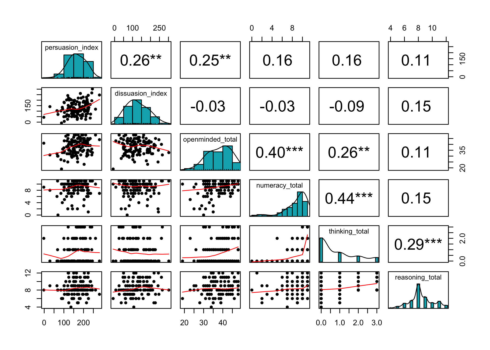

The code also works without writing x and y, however, writing them is strongly recommended


```r
plot(exam_data$Anxiety, exam_data$Exam)
```

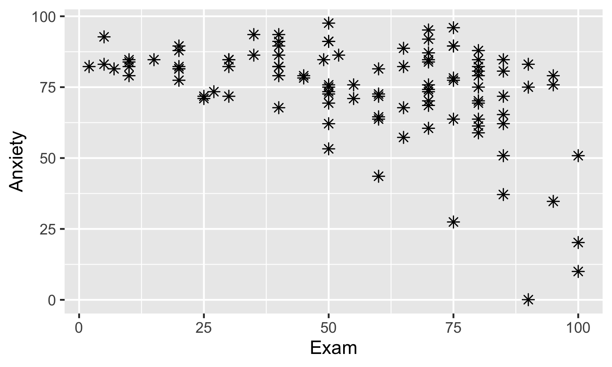

`ggplot`, the gg in ggplot stands for grammar of graphics. Grammar of graphics basically says any graphical representation of data, can be produced by a series of layers. You can think of a layer as a plastic transparency. Lets draw the same plot using ggplot. Always, mention the data we are going to work with.

```r
ggplot(data = exam_data, aes(x = Exam, y = Anxiety))
```


- `aes`: aes which stands for aesthetics is a relationship between a variable in your dataset and an aspect of the plot that is going to visually convey the information to the reader

- Visual elements are known as geoms (short for 'geometric objects') in ggplot 2. When we define a layer, we have to tell R what geom we want displayed on that layer (do we want a bar, line dot, etc.?)


```r
ggplot(data = exam_data, aes(x = Exam, y = Anxiety))+ geom_point()
```

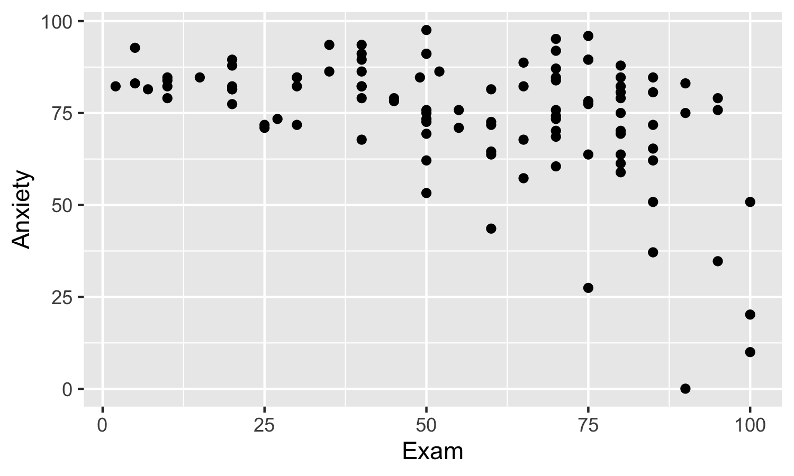

So, lets try some of them here like shape and size. Be careful with the + sign, if you clink enter for the next part of the code, the + sign should not go to the next line


```r
ggplot(data = exam_data, aes(x = Exam, y = Anxiety))+
  geom_point(size = 2, shape = 8)
```


The current plot is not very informative about the patterns for each gender.

```r
ggplot(data = exam_data, aes(x = Exam, y = Anxiety, color = Gender))+
  geom_point(size = 2, shape = 10)
```

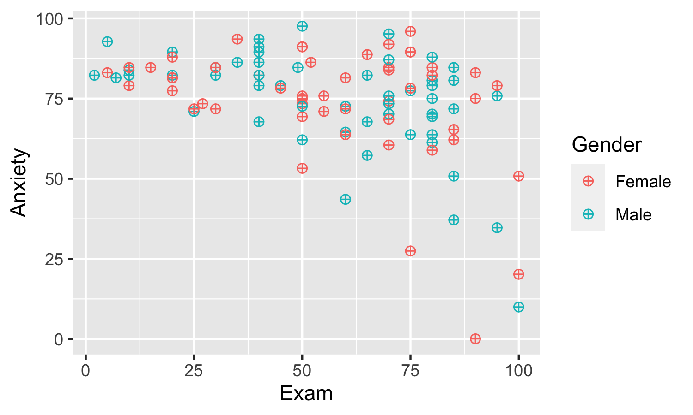

```r
ggplot(data = exam_data, aes(x = Exam, y = Anxiety, color = Gender, shape = Gender))+
  geom_point(size = 2, shape = 10)
```


Question: why the above code doesn't make any change?


```r
ggplot(data = exam_data, aes(x = Exam, y = Anxiety, color = Gender, shape = Gender))+
  geom_point(size = 2)
```

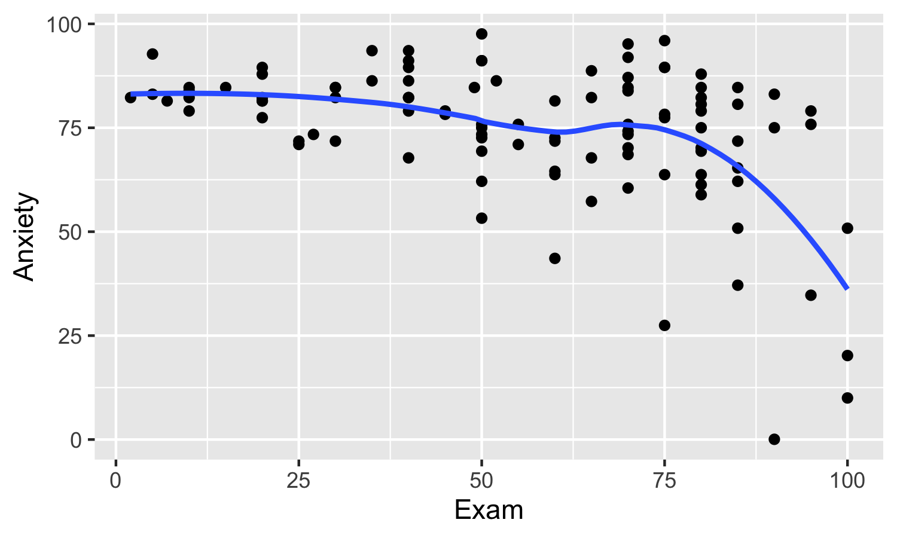

Can assign the first layer to a variable to reduce the length of codes for next layers.


```r
My_graph <- ggplot(data = exam_data, aes(x = Exam, y = Anxiety))

My_graph + geom_point()
```

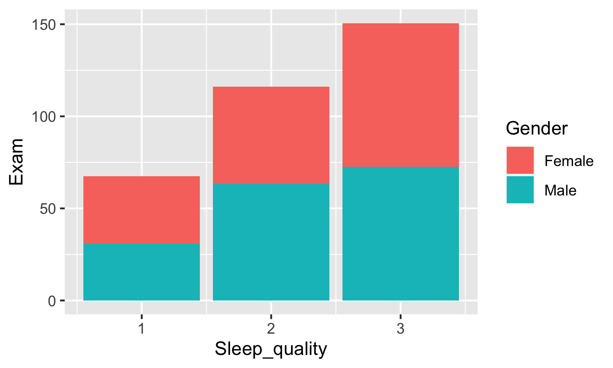

lets add a line to the current graph

```r
My_graph + geom_point() + geom_smooth()
```

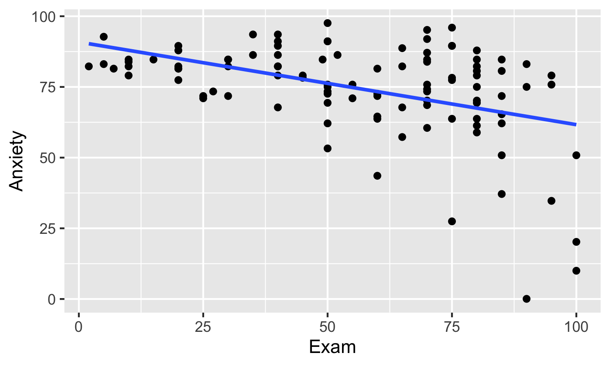

Aesthetics can be set for all layers of the plot (i.e., defined in the plot as a whole) or can be set individually for each geom in a plot.


```r
My_graph + geom_point(aes(color = Gender)) + geom_smooth()
```


```r
My_graph + geom_point(aes(color = Gender)) + geom_smooth(aes(color = Gender))
```

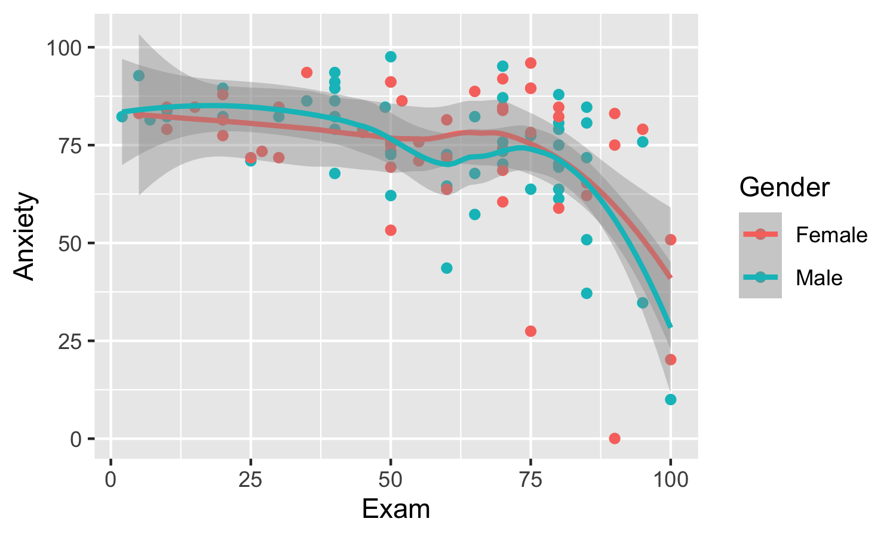

The shaded area around the line is the 95% confidence interval around the line. We can switch this off by  adding `se = F` (which is short for 'standard error = False')


```r
My_graph + geom_point() + geom_smooth(se = F)
```

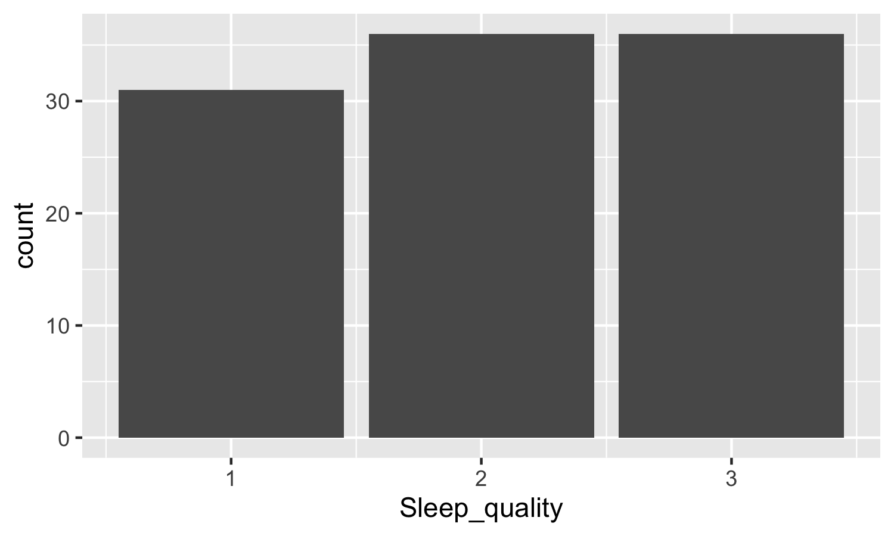


What if we want our line to be a direct line?

```r
My_graph + geom_point() + geom_smooth(se = F, method = lm)
```


How to change the labels of x and y axes?

```r
My_graph + geom_point() + geom_smooth(se = F, method = lm) +
  labs(x = "Exam scores %", y = "Anxiety scores")
```


Histograms are used to show distributions of variables while bar charts are used to compare variables. Histograms plot quantitative data with ranges of the data grouped into bins or intervals while bar charts plot categorical data.


```r
#ggplot(data = exam_data, aes(x = Anxiety, y = Exam )) + geom_histogram()
# the code above gives an error as geom_histogram can only have x or y axis in its aes()

ggplot(data = exam_data, aes(x = Anxiety)) + geom_histogram()
```


```r
ggplot(data = exam_data, aes(y = Anxiety)) + geom_histogram()
```


```r
ggplot(data = exam_data, aes(x = Anxiety)) + geom_histogram(bins = 31)
```


```r
ggplot(data = exam_data, aes(x = Anxiety)) + geom_histogram(bins = 31, fill = "green")
```


```r
ggplot(data = exam_data, aes(x = Anxiety)) + geom_histogram(bins = 31, fill = "green", col = "red")
```


Let's stop using the My_graph variable and write the whole code from the start again for a bar chart

```r
ggplot(data = exam_data, aes(x = Sleep_quality))+
  geom_bar()
```


Because we want to plot a summary of the data (the mean) rather than the raw scores themselves, we have to use a stat.

```r
ggplot(data = exam_data, aes(x = Sleep_quality, y = Exam, fill = Gender))+
  geom_bar(stat = "summary", fun = "mean")
```


```r
ggplot(data = exam_data, aes(x = Sleep_quality, y = Exam, fill = Gender))+
  geom_bar(stat = "summary", fun = "mean", position = "dodge")
```


The other way to get the same plot that the code above gives, is using the stat_summary function that takes the following general form: `stat_summary(function = x, geom = y)`


```r
ggplot(data = exam_data, aes(x = Sleep_quality, y = Exam, fill = Gender))+
  stat_summary(fun = mean, geom = "bar", position = "dodge")
```

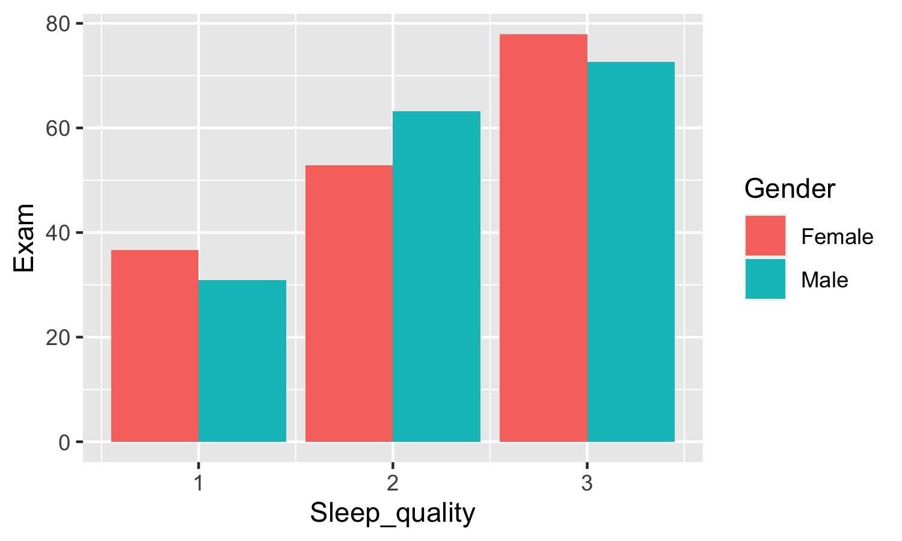
How to combine multiple plots? How to combine multiple plots? We can use the `patchwork` package. A nice tutorial on using this package can be found [here](https://patchwork.data-imaginist.com/articles/patchwork.html)


```r
p1 = My_graph + geom_point(aes(color = Gender)) + geom_smooth()

p2 = ggplot(data = exam_data, aes(x = Anxiety)) + geom_histogram(bins = 31)

p3 = ggplot(data = exam_data, aes(x = Sleep_quality, y = Exam, fill = Gender))+
  stat_summary(fun = mean, geom = "bar", position = "dodge")

p4 = My_graph + geom_point() + geom_smooth(se = F, method = lm) +
  labs(x = "Exam scores %", y = "Anxiety scores")

combined = p1 + p2+ p3 + p4 + plot_layout(nrow = 4, byrow = F)

combined
```


```r
p1 | p2 / p3 / p4
```


```r
p1 | p2 / (p3 / p4)
```


`ggsave()` function, which is a versatile exporting function that can export as PostScript (.eps/.ps), tex (pictex), pdf, jpeg, tiff, png, bmp, svg and wmf (in Windows only). In its basic form, the structure of the function is very simple: `ggsave(filename)`


```r
ggsave(combined, filename = here("outputs", "combined.png"), dpi=300)
```


Now that we learned the basics of ggplot, let's draw some plot for our experiment data. First, we need to create a dataset with aggregated `truth estimate` scores over `group` and `stage`. We will use this dataset for line and bar graphs.


```r
aggregated_data_exp1 <- data_exp1 %>%
  group_by(stage, group) %>%
  mutate(truth_estimate = mean(truth_estimate)) %>%
  ungroup()

barplot_exp1 <- aggregated_data_exp1 %>%
  ggplot(aes(x=stage, y= truth_estimate, fill=group)) +
  geom_bar(stat = "identity", position= "dodge")+
  # stat_summary(fun= mean, geom = "bar", position = "dodge")+ # can be used instead of geom_bar() for long dataframes
  labs (x= '', y= "Truth Likelihhod Estimate") + 
  theme_bw() + 
  scale_fill_jama() 

barplot_exp1
```


```r
barplot_facet_exp1 <- aggregated_data_exp1 %>%
  ggplot(aes(x=group, y= truth_estimate, fill=stage)) +
  geom_bar(stat = "identity", position= "dodge")+
  labs (x= '', y= "Truth Likelihhod Estimate") + 
  theme_bw() + 
  theme(legend.position = "none",
        axis.text=element_text(size=11),
        axis.title = element_text(size = 12)) +
  facet_wrap(~stage)+
  scale_fill_jco() 

barplot_facet_exp1
```


```r
lineplot_exp1 <- aggregated_data_exp1 %>%
  ggplot(aes(x=factor(stage), y= truth_estimate, group= group, color= group)) +
  geom_line(aes(linetype= group)) +
  geom_point(size= 5)+
  labs (x= '', y= "Truth Likelihhod Estimate") + 
  theme_classic() +
  theme(legend.position = "bottom",
        axis.text=element_text(size=11),
        axis.title = element_text(size = 12)) +
  scale_color_nejm() 

lineplot_exp1
```


```r
violinplot_exp1 <- data_exp1 %>%
  ggplot(aes(x=factor(stage), y= truth_estimate, fill= group)) +
  geom_violin()+
  labs (x= '', y= "Truth Likelihhod Estimate") + 
  theme_bw() + 
  theme(legend.position = "bottom",
        axis.text=element_text(size=11),
        axis.title = element_text(size = 12)) +
  scale_fill_d3() 

violinplot_exp1
```


```r
boxplot_exp1 <- data_exp1 %>%
  ggplot(aes(x=factor(stage), y= truth_estimate, fill= group)) +
  geom_boxplot()+
  #geom_point(position = position_dodge(width=0.75), alpha= .5)+
  labs (x= '', y= "Truth Likelihhod Estimate") + 
  theme_bw() + 
  theme(legend.position = "bottom",
        axis.text=element_text(size=11),
        axis.title = element_text(size = 12)) +
  scale_fill_simpsons() 

boxplot_exp1
```


```r
boxplot_facet_exp1 <- data_exp1 %>%
  ggplot(aes(x=factor(stage), y= truth_estimate, fill= group)) +
  geom_boxplot()+
  labs (x= '', y= "Truth Likelihhod Estimate") + 
  theme_bw() + 
  theme(legend.position = "bottom",
        axis.text=element_text(size=11),
        axis.title = element_text(size = 12),
        axis.text.x = element_text(angle = 90, vjust = 0.5, hjust=1)) +
  facet_wrap(~group)+
  scale_color_simpsons() 

boxplot_facet_exp1
```


HLet's combine our plots:

<div class="figure" style="text-align: center">

<p class="caption">Artwork by Allison Horst: https://github.com/allisonhorst/stats-illustrations</p>
</div>


```r
combined_plot_exp1 <- (barplot_facet_exp1+lineplot_exp1) / (violinplot_exp1+boxplot_exp1)
combined_plot_exp1
```


And here, we save our plots to the `outputs` folder.

```rmessage
ggsave(combined_plot_exp1, filename = here("outputs","combined_plot_exp1.png"), dpi=300)
```

# Data Analysis


## t-test

Now, we use the treatment data to run three different independent t-tests. Suppose we did an experiment to compare the effectiveness of CBT vs. Psychodynamic therapies in decreasing anxiety, and depression and also in improving life satisfaction:


```r
# t.test (indep)
t.test(anxiety~treatment, data= treatment_data)
```

```
## 
## 	Welch Two Sample t-test
## 
## data:  anxiety by treatment
## t = -0.85021, df = 124.18, p-value = 0.3968
## alternative hypothesis: true difference in means is not equal to 0
## 95 percent confidence interval:
##  -12.11096   4.83264
## sample estimates:
##           mean in group CBT mean in group Psychodynamic 
##                    60.54545                    64.18462
```

```r
t.test(depression~treatment, data= treatment_data)
```

```
## 
## 	Welch Two Sample t-test
## 
## data:  depression by treatment
## t = -2.8725, df = 123.97, p-value = 0.004792
## alternative hypothesis: true difference in means is not equal to 0
## 95 percent confidence interval:
##  -18.21965  -3.35424
## sample estimates:
##           mean in group CBT mean in group Psychodynamic 
##                    47.15152                    57.93846
```

```r
t.test(life_satisfaction~treatment, data= treatment_data)
```

```
## 
## 	Welch Two Sample t-test
## 
## data:  life_satisfaction by treatment
## t = -5.2688, df = 127.11, p-value = 0.0000005699
## alternative hypothesis: true difference in means is not equal to 0
## 95 percent confidence interval:
##  -27.61850 -12.53721
## sample estimates:
##           mean in group CBT mean in group Psychodynamic 
##                    31.06061                    51.13846
```

In another experiment, suppose we have created a method to boost memory. Then, we recruit some participants, do a memory pre-test, implement the method, and do a memory post-test, Now, we want to see whether our method have improved participants' memory: 


```r
# t.test (paired)
t.test(memory_score~time, data= memory_data, paired= T)
```

```
## 
## 	Paired t-test
## 
## data:  memory_score by time
## t = 5.4761, df = 130, p-value = 0.0000002163
## alternative hypothesis: true difference in means is not equal to 0
## 95 percent confidence interval:
##   7.333171 15.628661
## sample estimates:
## mean of the differences 
##                11.48092
```

Now that we learned about t-test, let's perform this test on our dataset. Is there a difference between groups at the first stage? Ideally, we want participants' ratings at the first stage be similar for both groups because we have not done any manipulations. Previous graphs showed us that ratings of simple and complex group at this stage are pretty close. Let's test that using an **independent t-test** (because we have 2 independent groups):


```r
# Is there a difference between groups at the first stage?
data_exp1 %>% 
  group_by(group) %>% 
  filter(stage=='stage1') %>% 
  ungroup () %>%
  t.test(truth_estimate~group, data = ., paired=FALSE)
```

```
## 
## 	Welch Two Sample t-test
## 
## data:  truth_estimate by group
## t = -0.75145, df = 104.95, p-value = 0.4541
## alternative hypothesis: true difference in means is not equal to 0
## 95 percent confidence interval:
##  -11.883716   5.351781
## sample estimates:
## mean in group Complex  mean in group Simple 
##              55.44615              58.71212
```

Now, we wonder if opposing arguments were effective at all, regardless of participants' group. So, we would like to test if ratings at the final stage are lower than ratings at the stage 4? Since a pair of score at stage 4 and stage 7 is coming from a same person, we use **paired t-test**.


```r
# Is there a difference between ratings of stage4 and stage7?
data_exp1 %>% 
  filter(stage=='stage4' | stage=='stage7') %>% 
  ungroup () %>%
  t.test(truth_estimate~stage, data = ., paired=TRUE)
```

```
## 
## 	Paired t-test
## 
## data:  truth_estimate by stage
## t = 12.788, df = 130, p-value < 0.00000000000000022
## alternative hypothesis: true difference in means is not equal to 0
## 95 percent confidence interval:
##  32.64368 44.59296
## sample estimates:
## mean of the differences 
##                38.61832
```


### Exercise

John et al. (2019) investigated the consequences of backing down (changing one's mind in lights of evidence)and how other people view someone who change their mind. In their second experiments, they presented participants either with a person who changes their mind or a person who refuses to back down. Then, they asked participants to rate how intelligent and confident the person is (See the original study [here](https://www.hbs.edu/faculty/Publication%20Files/John%20et%20al%20-%20self-presentational%20consequences_b85b2c43-a5b5-474c-9e2c-e9853b10727e.pdf)). They reported that: 

> "Relative to the entrepreneur who did not back down, participants judged the entrepreneur who backed down as more intelligent (M_backed_down=5.13 out of 7, SD=1.09; M_did_not_back_down=3.97, SD=1.54; t(271.12)=−7.59, p < .001) but less confident (M_backed_down=4.50 out of 7, SD=1.36; M_did_not_back_down=5.65, SD=1.10; t(291.01)=8.08, p < .001).".

Open the `john_backdown_exp2.csv` file and try to reproduce their results. Run two separate independent t-test, one with `intelligent` as the dependent variable and one with `confident` as the dependent variable. For both t-test, use `back_down` as the between-subject independent variable.


```r
john_data <- read_csv(here("cleaned_data","john_backdown_exp2.csv"))


t.test(intelligent~back_down, data = john_data, paired=FALSE)
```

```
## 
## 	Welch Two Sample t-test
## 
## data:  intelligent by back_down
## t = 7.5853, df = 271.12, p-value = 0.0000000000005319
## alternative hypothesis: true difference in means is not equal to 0
## 95 percent confidence interval:
##  0.8577107 1.4590076
## sample estimates:
##       mean in group backed_down mean in group did_not_back_down 
##                        5.129412                        3.971053
```

```r
t.test(confident~back_down, data = john_data, paired=FALSE)
```

```
## 
## 	Welch Two Sample t-test
## 
## data:  confident by back_down
## t = -8.0763, df = 291.01, p-value = 0.00000000000001787
## alternative hypothesis: true difference in means is not equal to 0
## 95 percent confidence interval:
##  -1.4257768 -0.8670294
## sample estimates:
##       mean in group backed_down mean in group did_not_back_down 
##                        4.503268                        5.649671
```


## Analysis of Variance (ANOVA)

Now, let's answer our main question: Do participants in the simple group show higher ratings for supportive arguments (stage 2 to 4) and lower ratings for opposing arguments (stage 5 to 7), compared to participants in the complex group? If this is the case. we expect an interaction in the traditional **Analysis of Variance (AONVA)** test.


```r
aov_m1 <- aov_car (truth_estimate ~ group*stage +
                     Error(subject/stage), data = data_exp1)
```

<table class="table table-striped table-bordered table-condensed" style="margin-left: auto; margin-right: auto;">
 <thead>
  <tr>
   <th style="text-align:left;position: sticky; top:0; background-color: #FFFFFF;"> Effect </th>
   <th style="text-align:left;position: sticky; top:0; background-color: #FFFFFF;"> df </th>
   <th style="text-align:left;position: sticky; top:0; background-color: #FFFFFF;"> MSE </th>
   <th style="text-align:left;position: sticky; top:0; background-color: #FFFFFF;"> F </th>
   <th style="text-align:left;position: sticky; top:0; background-color: #FFFFFF;"> ges </th>
   <th style="text-align:left;position: sticky; top:0; background-color: #FFFFFF;"> p.value </th>
  </tr>
 </thead>
<tbody>
  <tr>
   <td style="text-align:left;"> group </td>
   <td style="text-align:left;"> 1, 129 </td>
   <td style="text-align:left;"> 949.04 </td>
   <td style="text-align:left;"> 0.01 </td>
   <td style="text-align:left;"> &lt;.0001 </td>
   <td style="text-align:left;"> .94 </td>
  </tr>
  <tr>
   <td style="text-align:left;"> stage </td>
   <td style="text-align:left;"> 4.45, 574.05 </td>
   <td style="text-align:left;"> 515.69 </td>
   <td style="text-align:left;"> 59.48 *** </td>
   <td style="text-align:left;"> .25 </td>
   <td style="text-align:left;"> &lt;.0001 </td>
  </tr>
  <tr>
   <td style="text-align:left;"> group:stage </td>
   <td style="text-align:left;"> 4.45, 574.05 </td>
   <td style="text-align:left;"> 515.69 </td>
   <td style="text-align:left;"> 13.34 *** </td>
   <td style="text-align:left;"> .07 </td>
   <td style="text-align:left;"> &lt;.0001 </td>
  </tr>
</tbody>
</table>

As you can see, we found a significant main effect of stage and a significant group by stage interaction. We can use the `emmeans` package to do post-hoc tests.


```r
# main effect of stage
emmeans(aov_m1, 'stage')
```

```
##  stage  emmean   SE  df lower.CL upper.CL
##  stage1   57.1 1.88 763     53.4     60.8
##  stage2   66.8 1.88 763     63.1     70.5
##  stage3   74.6 1.88 763     70.9     78.3
##  stage4   79.6 1.88 763     75.9     83.3
##  stage5   62.4 1.88 763     58.7     66.1
##  stage6   52.5 1.88 763     48.9     56.2
##  stage7   41.1 1.88 763     37.4     44.8
## 
## Results are averaged over the levels of: group 
## Warning: EMMs are biased unless design is perfectly balanced 
## Confidence level used: 0.95
```

```r
pairs(emmeans(aov_m1, 'stage'), adjust= 'holm')
```

```
##  contrast        estimate   SE  df t.ratio p.value
##  stage1 - stage2    -9.74 2.42 774 -4.031  0.0004 
##  stage1 - stage3   -17.53 2.42 774 -7.256  <.0001 
##  stage1 - stage4   -22.50 2.42 774 -9.311  <.0001 
##  stage1 - stage5    -5.29 2.42 774 -2.187  0.1160 
##  stage1 - stage6     4.53 2.42 774  1.876  0.1220 
##  stage1 - stage7    15.98 2.42 774  6.613  <.0001 
##  stage2 - stage3    -7.79 2.42 774 -3.225  0.0066 
##  stage2 - stage4   -12.76 2.42 774 -5.280  <.0001 
##  stage2 - stage5     4.46 2.42 774  1.844  0.1220 
##  stage2 - stage6    14.28 2.42 774  5.908  <.0001 
##  stage2 - stage7    25.72 2.42 774 10.644  <.0001 
##  stage3 - stage4    -4.97 2.42 774 -2.055  0.1206 
##  stage3 - stage5    12.25 2.42 774  5.069  <.0001 
##  stage3 - stage6    22.07 2.42 774  9.132  <.0001 
##  stage3 - stage7    33.51 2.42 774 13.869  <.0001 
##  stage4 - stage5    17.22 2.42 774  7.124  <.0001 
##  stage4 - stage6    27.04 2.42 774 11.188  <.0001 
##  stage4 - stage7    38.48 2.42 774 15.924  <.0001 
##  stage5 - stage6     9.82 2.42 774  4.064  0.0004 
##  stage5 - stage7    21.27 2.42 774  8.800  <.0001 
##  stage6 - stage7    11.45 2.42 774  4.736  <.0001 
## 
## Results are averaged over the levels of: group 
## P value adjustment: holm method for 21 tests
```


```r
# group by stage interaction
emmeans(aov_m1, "group", by= "stage")
```

```
## stage = stage1:
##  group   emmean   SE  df lower.CL upper.CL
##  Complex   55.4 2.67 766     50.2     60.7
##  Simple    58.7 2.65 761     53.5     63.9
## 
## stage = stage2:
##  group   emmean   SE  df lower.CL upper.CL
##  Complex   63.3 2.67 766     58.1     68.6
##  Simple    70.3 2.65 761     65.1     75.5
## 
## stage = stage3:
##  group   emmean   SE  df lower.CL upper.CL
##  Complex   70.0 2.67 766     64.7     75.2
##  Simple    79.3 2.65 761     74.1     84.5
## 
## stage = stage4:
##  group   emmean   SE  df lower.CL upper.CL
##  Complex   71.6 2.67 766     66.3     76.8
##  Simple    87.6 2.65 761     82.4     92.8
## 
## stage = stage5:
##  group   emmean   SE  df lower.CL upper.CL
##  Complex   64.2 2.67 766     58.9     69.4
##  Simple    60.5 2.65 761     55.3     65.8
## 
## stage = stage6:
##  group   emmean   SE  df lower.CL upper.CL
##  Complex   57.9 2.67 766     52.7     63.2
##  Simple    47.2 2.65 761     41.9     52.4
## 
## stage = stage7:
##  group   emmean   SE  df lower.CL upper.CL
##  Complex   51.1 2.67 766     45.9     56.4
##  Simple    31.1 2.65 761     25.9     36.3
## 
## Warning: EMMs are biased unless design is perfectly balanced 
## Confidence level used: 0.95
```

```r
update(pairs(emmeans(aov_m1, "group", by= "stage")), by = NULL, adjust = "holm") 
```

```
##  contrast         stage  estimate   SE  df t.ratio p.value
##  Complex - Simple stage1    -3.27 3.76 763 -0.868  0.6673 
##  Complex - Simple stage2    -6.96 3.76 763 -1.851  0.1935 
##  Complex - Simple stage3    -9.29 3.76 763 -2.469  0.0550 
##  Complex - Simple stage4   -16.02 3.76 763 -4.259  0.0001 
##  Complex - Simple stage5     3.64 3.76 763  0.967  0.6673 
##  Complex - Simple stage6    10.79 3.76 763  2.868  0.0213 
##  Complex - Simple stage7    20.08 3.76 763  5.337  <.0001 
## 
## P value adjustment: holm method for 7 tests
```

You can use the `afex_plot` function from afex to create beautiful plots. Those plots interacts nicely with ggplot:

```r
afex_plot(aov_m1, x = "stage", trace = "group", error='between',
          line_arg = list(size=1),
          point_arg = list(size=3.5),
          data_arg = list(size= 1, color= 'grey', width=.4),
          data_geom = geom_boxplot,
          mapping = c("linetype", "shape", "fill"),
          legend_title = "Group") +
  labs(y = "Truth Likelihhod Estimate", x = "") +
  theme_bw()+ # remove the grey background and grid
  theme(axis.text=element_text(size=13),
        axis.title = element_text(size = 13),
        legend.text=element_text(size=13),
        legend.title=element_text(size=13),
        legend.position='bottom',
        legend.key.size = unit(1, "cm"),
        legend.background = element_rect(colour = 'black', fill = 'white', linetype='solid'))+
  scale_color_simpsons() +
  scale_fill_simpsons()
```

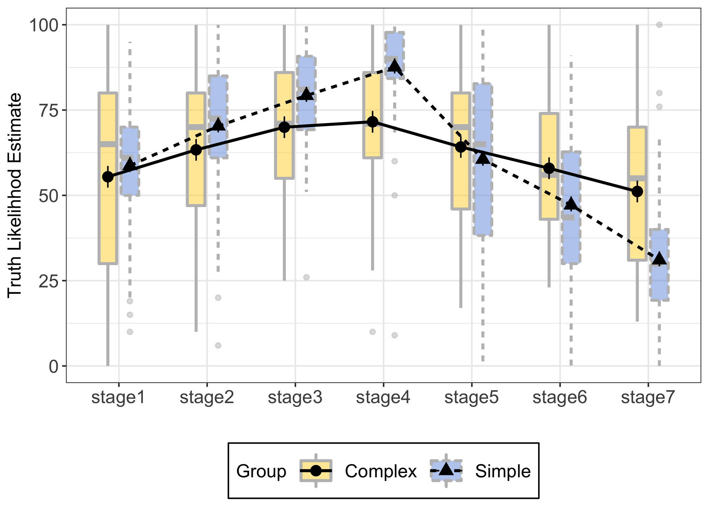


If you are interested in this topic, check out this nice tutorial about [using afex to run ANOVA](https://cran.r-project.org/web/packages/afex/vignettes/afex_anova_example.html), and also this interesting tutorial on the [emmeans package](https://aosmith.rbind.io/2019/03/25/getting-started-with-emmeans/).

### Exercise

Rotello et al. (2018) investigated the association between the race (White vs. Black faces) and the gun-tool judgments. In their first experiments, they presented participants with 16 White male faces and 16 Black male faces, and following that 8 images of guns and 8 images of tools. They asked participants to judge if the object is a tool or a gun by pressing keyboard buttons. Then, they ran an ANOVA to see if participants' gun responses are higher for any of the races. So, they included prime race (Black, White) and target identity (gun, tool) as independent variables and participants' gun responses as dependent variable into their linear model (See the original study [here](https://online.ucpress.edu/collabra/article/4/1/32/112986/The-Shape-of-ROC-Curves-in-Shooter-Tasks)). They found that: 

> "Participants made more gun responses to guns than to tools, F(1,45) = 53243, p < 0.0001, η2g = 0.998. However, the race of the prime face did not matter, F(1,45) = 0.287, p > 0.59, η2g = 0.001, nor was there an interaction of prime race with target object, F(1,45) = 0.022, p > 0.88, η2g = 0.000)".

Open the `rotello_shooter_exp1.csv` file and try to reproduce their results. Run an ANOVA (type III) with `resp` as the dependent variable and target, prime, and their interaction as independent variables.


```r
# load the general data file
rotello_data <- read_csv(here("cleaned_data","rotello_shooter_exp1.csv"))

# ANOVA
rotello_aov <- aov_car (resp ~ target*prime +
           Error(subject/target*prime), data = rotello_data)
```

<table class="table table-striped table-bordered table-condensed" style="margin-left: auto; margin-right: auto;">
 <thead>
  <tr>
   <th style="text-align:left;position: sticky; top:0; background-color: #FFFFFF;"> Effect </th>
   <th style="text-align:left;position: sticky; top:0; background-color: #FFFFFF;"> df </th>
   <th style="text-align:left;position: sticky; top:0; background-color: #FFFFFF;"> MSE </th>
   <th style="text-align:left;position: sticky; top:0; background-color: #FFFFFF;"> F </th>
   <th style="text-align:left;position: sticky; top:0; background-color: #FFFFFF;"> ges </th>
   <th style="text-align:left;position: sticky; top:0; background-color: #FFFFFF;"> p.value </th>
  </tr>
 </thead>
<tbody>
  <tr>
   <td style="text-align:left;"> target </td>
   <td style="text-align:left;"> 1, 45 </td>
   <td style="text-align:left;"> 0.00 </td>
   <td style="text-align:left;"> 53242.99 *** </td>
   <td style="text-align:left;"> &gt;.99 </td>
   <td style="text-align:left;"> &lt;.0001 </td>
  </tr>
  <tr>
   <td style="text-align:left;"> prime </td>
   <td style="text-align:left;"> 1, 45 </td>
   <td style="text-align:left;"> 0.00 </td>
   <td style="text-align:left;"> 0.29 </td>
   <td style="text-align:left;"> .001 </td>
   <td style="text-align:left;"> .59 </td>
  </tr>
  <tr>
   <td style="text-align:left;"> target:prime </td>
   <td style="text-align:left;"> 1, 45 </td>
   <td style="text-align:left;"> 0.00 </td>
   <td style="text-align:left;"> 0.02 </td>
   <td style="text-align:left;"> &lt;.0001 </td>
   <td style="text-align:left;"> .88 </td>
  </tr>
</tbody>
</table>


## Correlation

Here, we want to check the correlation between variables on the `narcissism_data`. First, we need to remove `subject` column because it is not numeric:

```r
narcissism_data_cor <- narcissism_data %>%
  select(-subject)
```


```r
#-- Base R:
cor(narcissism_data_cor, method = "pearson",  use = "complete.obs")

#-- Psych library:
psych::pairs.panels(narcissism_data_cor, method = "pearson", hist.col = "#00AFBB", density = T, ellipses = F, stars = T)

#-- Correlation library:
# install.packages("devtools")
# devtools::install_github("easystats/correlation")
#library("correlation")
correlation::correlation(narcissism_data_cor) %>% summary()

#-- apaTables library:
narcissism_data_cor %>% 
  apaTables::apa.cor.table(filename="./outputs/CorMatrix.doc", show.conf.interval=T)
```

<table class="table table-striped table-bordered table-condensed" style="width: auto !important; margin-left: auto; margin-right: auto;">
 <thead>
  <tr>
   <th style="text-align:left;position: sticky; top:0; background-color: #FFFFFF;">   </th>
   <th style="text-align:right;position: sticky; top:0; background-color: #FFFFFF;"> psychopathy </th>
   <th style="text-align:right;position: sticky; top:0; background-color: #FFFFFF;"> self_esteem </th>
   <th style="text-align:right;position: sticky; top:0; background-color: #FFFFFF;"> narcissism </th>
   <th style="text-align:right;position: sticky; top:0; background-color: #FFFFFF;"> mental_health </th>
  </tr>
 </thead>
<tbody>
  <tr>
   <td style="text-align:left;"> psychopathy </td>
   <td style="text-align:right;"> 1.00 </td>
   <td style="text-align:right;"> 0.15 </td>
   <td style="text-align:right;"> 0.40 </td>
   <td style="text-align:right;"> -0.44 </td>
  </tr>
  <tr>
   <td style="text-align:left;"> self_esteem </td>
   <td style="text-align:right;"> 0.15 </td>
   <td style="text-align:right;"> 1.00 </td>
   <td style="text-align:right;"> 0.11 </td>
   <td style="text-align:right;"> -0.29 </td>
  </tr>
  <tr>
   <td style="text-align:left;"> narcissism </td>
   <td style="text-align:right;"> 0.40 </td>
   <td style="text-align:right;"> 0.11 </td>
   <td style="text-align:right;"> 1.00 </td>
   <td style="text-align:right;"> -0.26 </td>
  </tr>
  <tr>
   <td style="text-align:left;"> mental_health </td>
   <td style="text-align:right;"> -0.44 </td>
   <td style="text-align:right;"> -0.29 </td>
   <td style="text-align:right;"> -0.26 </td>
   <td style="text-align:right;"> 1.00 </td>
  </tr>
</tbody>
</table>

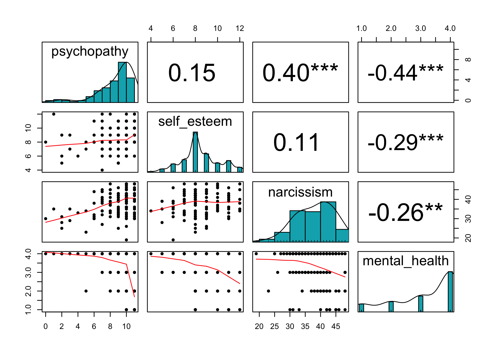<table class="table table-striped table-bordered table-condensed" style="width: auto !important; margin-left: auto; margin-right: auto;">
 <thead>
  <tr>
   <th style="text-align:left;position: sticky; top:0; background-color: #FFFFFF;"> Parameter </th>
   <th style="text-align:right;position: sticky; top:0; background-color: #FFFFFF;"> mental_health </th>
   <th style="text-align:right;position: sticky; top:0; background-color: #FFFFFF;"> narcissism </th>
   <th style="text-align:right;position: sticky; top:0; background-color: #FFFFFF;"> self_esteem </th>
  </tr>
 </thead>
<tbody>
  <tr>
   <td style="text-align:left;"> psychopathy </td>
   <td style="text-align:right;"> -0.44 </td>
   <td style="text-align:right;"> 0.40 </td>
   <td style="text-align:right;"> 0.15 </td>
  </tr>
  <tr>
   <td style="text-align:left;"> self_esteem </td>
   <td style="text-align:right;"> -0.29 </td>
   <td style="text-align:right;"> 0.11 </td>
   <td style="text-align:right;">  </td>
  </tr>
  <tr>
   <td style="text-align:left;"> narcissism </td>
   <td style="text-align:right;"> -0.26 </td>
   <td style="text-align:right;">  </td>
   <td style="text-align:right;">  </td>
  </tr>
</tbody>
</table>


Now that we learned about correlation test, let's answer to another question of this study: does persuasion and dissuasion is related to open-mindedness, cognitive ability, reasoning abilities, and thinking style? To answer this question, we need to create two indexes (scores) one for persuasion and one for dissuasion. Then we can do a correlation test:


```r
cor_data_exp1 <- data_exp1 %>% 
  pivot_wider(names_from = stage, values_from = truth_estimate) %>%
  group_by(subject) %>%
  mutate(persuasion_index= stage2+ stage3+ stage4 - stage1,
         dissuasion_index= (101-stage5) + (101-stage6) + (101-stage7) - (101-stage4)) %>%
  ungroup()%>%
  dplyr::select(persuasion_index,dissuasion_index,openminded_total,numeracy_total,thinking_total,reasoning_total)

#---------- Base R:
cor(cor_data_exp1, method = "pearson",  use = "complete.obs")

#---------- Psych library:
cor_data_exp1 %>% 
  psych::pairs.panels(method = "pearson", hist.col = "#00AFBB", density = T, ellipses = F, stars = T)

#---------- Correlation library:
correlation::correlation(cor_data_exp1) %>% summary()

#---------- apaTables library:
cor_data_exp1 %>% 
  apaTables::apa.cor.table(filename="./outputs/CorMatrix.doc", show.conf.interval=T)
```

<div style="border: 1px solid #ddd; padding: 5px; overflow-x: scroll; width:780px; "><table class="table table-striped table-bordered table-condensed" style="width: auto !important; margin-left: auto; margin-right: auto;">
 <thead>
  <tr>
   <th style="text-align:left;position: sticky; top:0; background-color: #FFFFFF;">   </th>
   <th style="text-align:right;position: sticky; top:0; background-color: #FFFFFF;"> persuasion_index </th>
   <th style="text-align:right;position: sticky; top:0; background-color: #FFFFFF;"> dissuasion_index </th>
   <th style="text-align:right;position: sticky; top:0; background-color: #FFFFFF;"> openminded_total </th>
   <th style="text-align:right;position: sticky; top:0; background-color: #FFFFFF;"> numeracy_total </th>
   <th style="text-align:right;position: sticky; top:0; background-color: #FFFFFF;"> thinking_total </th>
   <th style="text-align:right;position: sticky; top:0; background-color: #FFFFFF;"> reasoning_total </th>
  </tr>
 </thead>
<tbody>
  <tr>
   <td style="text-align:left;"> persuasion_index </td>
   <td style="text-align:right;"> 1.00 </td>
   <td style="text-align:right;"> 0.26 </td>
   <td style="text-align:right;"> 0.25 </td>
   <td style="text-align:right;"> 0.16 </td>
   <td style="text-align:right;"> 0.16 </td>
   <td style="text-align:right;"> 0.11 </td>
  </tr>
  <tr>
   <td style="text-align:left;"> dissuasion_index </td>
   <td style="text-align:right;"> 0.26 </td>
   <td style="text-align:right;"> 1.00 </td>
   <td style="text-align:right;"> -0.03 </td>
   <td style="text-align:right;"> -0.03 </td>
   <td style="text-align:right;"> -0.09 </td>
   <td style="text-align:right;"> 0.15 </td>
  </tr>
  <tr>
   <td style="text-align:left;"> openminded_total </td>
   <td style="text-align:right;"> 0.25 </td>
   <td style="text-align:right;"> -0.03 </td>
   <td style="text-align:right;"> 1.00 </td>
   <td style="text-align:right;"> 0.40 </td>
   <td style="text-align:right;"> 0.26 </td>
   <td style="text-align:right;"> 0.11 </td>
  </tr>
  <tr>
   <td style="text-align:left;"> numeracy_total </td>
   <td style="text-align:right;"> 0.16 </td>
   <td style="text-align:right;"> -0.03 </td>
   <td style="text-align:right;"> 0.40 </td>
   <td style="text-align:right;"> 1.00 </td>
   <td style="text-align:right;"> 0.44 </td>
   <td style="text-align:right;"> 0.15 </td>
  </tr>
  <tr>
   <td style="text-align:left;"> thinking_total </td>
   <td style="text-align:right;"> 0.16 </td>
   <td style="text-align:right;"> -0.09 </td>
   <td style="text-align:right;"> 0.26 </td>
   <td style="text-align:right;"> 0.44 </td>
   <td style="text-align:right;"> 1.00 </td>
   <td style="text-align:right;"> 0.29 </td>
  </tr>
  <tr>
   <td style="text-align:left;"> reasoning_total </td>
   <td style="text-align:right;"> 0.11 </td>
   <td style="text-align:right;"> 0.15 </td>
   <td style="text-align:right;"> 0.11 </td>
   <td style="text-align:right;"> 0.15 </td>
   <td style="text-align:right;"> 0.29 </td>
   <td style="text-align:right;"> 1.00 </td>
  </tr>
</tbody>
</table></div>

<div style="border: 1px solid #ddd; padding: 5px; overflow-x: scroll; width:780px; "><table class="table table-striped table-bordered table-condensed" style="width: auto !important; margin-left: auto; margin-right: auto;">
 <thead>
  <tr>
   <th style="text-align:left;position: sticky; top:0; background-color: #FFFFFF;"> Parameter </th>
   <th style="text-align:right;position: sticky; top:0; background-color: #FFFFFF;"> reasoning_total </th>
   <th style="text-align:right;position: sticky; top:0; background-color: #FFFFFF;"> thinking_total </th>
   <th style="text-align:right;position: sticky; top:0; background-color: #FFFFFF;"> numeracy_total </th>
   <th style="text-align:right;position: sticky; top:0; background-color: #FFFFFF;"> openminded_total </th>
   <th style="text-align:right;position: sticky; top:0; background-color: #FFFFFF;"> dissuasion_index </th>
  </tr>
 </thead>
<tbody>
  <tr>
   <td style="text-align:left;"> persuasion_index </td>
   <td style="text-align:right;"> 0.11 </td>
   <td style="text-align:right;"> 0.16 </td>
   <td style="text-align:right;"> 0.16 </td>
   <td style="text-align:right;"> 0.25 </td>
   <td style="text-align:right;"> 0.26 </td>
  </tr>
  <tr>
   <td style="text-align:left;"> dissuasion_index </td>
   <td style="text-align:right;"> 0.15 </td>
   <td style="text-align:right;"> -0.09 </td>
   <td style="text-align:right;"> -0.03 </td>
   <td style="text-align:right;"> -0.03 </td>
   <td style="text-align:right;">  </td>
  </tr>
  <tr>
   <td style="text-align:left;"> openminded_total </td>
   <td style="text-align:right;"> 0.11 </td>
   <td style="text-align:right;"> 0.26 </td>
   <td style="text-align:right;"> 0.40 </td>
   <td style="text-align:right;">  </td>
   <td style="text-align:right;">  </td>
  </tr>
  <tr>
   <td style="text-align:left;"> numeracy_total </td>
   <td style="text-align:right;"> 0.15 </td>
   <td style="text-align:right;"> 0.44 </td>
   <td style="text-align:right;">  </td>
   <td style="text-align:right;">  </td>
   <td style="text-align:right;">  </td>
  </tr>
  <tr>
   <td style="text-align:left;"> thinking_total </td>
   <td style="text-align:right;"> 0.29 </td>
   <td style="text-align:right;">  </td>
   <td style="text-align:right;">  </td>
   <td style="text-align:right;">  </td>
   <td style="text-align:right;">  </td>
  </tr>
</tbody>
</table></div>


### Exercise

Pennycook et al. (2020) investigated the relationship between actively open-minded thinking style about evidence (AOT-E) and different political, scientific, and religious beliefs (see the original paper [here](https://psyarxiv.com/a7k96)). In their first experiment, they calculated the correlation of AOTE and scientific beliefs items (global warming, evolution, etc.) and they found the following results:

<div class="figure" style="text-align: center">

<p class="caption">adapted from [Pennycook et al. (2020)](https://psyarxiv.com/a7k96)</p>
</div>

Open the `pennycook_aote_exp1.csv` file and try to reproduce their results by creating the same correlation matrix.


```r
pennycook_data <- read_csv(here("cleaned_data","pennycook_aote_exp1.csv")) 


#---------- Base R:
cor(pennycook_data, method = "pearson",  use = "complete.obs")

#---------- Psych library:
pennycook_data %>% 
  psych::pairs.panels(method = "pearson", hist.col = "#00AFBB", density = T, ellipses = F, stars = T)

#---------- Correlation library:
correlation::correlation(pennycook_data) %>% summary()

#---------- apaTables library:
pennycook_data %>% 
  apaTables::apa.cor.table(filename="./outputs/CorMatrix.doc", show.conf.interval=T)
```


<div style="border: 1px solid #ddd; padding: 5px; overflow-x: scroll; width:780px; "><table class="table table-striped table-bordered table-condensed" style="width: auto !important; margin-left: auto; margin-right: auto;">
 <thead>
  <tr>
   <th style="text-align:left;position: sticky; top:0; background-color: #FFFFFF;"> Parameter </th>
   <th style="text-align:right;position: sticky; top:0; background-color: #FFFFFF;"> trust_scien </th>
   <th style="text-align:right;position: sticky; top:0; background-color: #FFFFFF;"> gm_health </th>
   <th style="text-align:right;position: sticky; top:0; background-color: #FFFFFF;"> tech_problems </th>
   <th style="text-align:right;position: sticky; top:0; background-color: #FFFFFF;"> modern_medicine </th>
   <th style="text-align:right;position: sticky; top:0; background-color: #FFFFFF;"> old_earth </th>
   <th style="text-align:right;position: sticky; top:0; background-color: #FFFFFF;"> vaccines </th>
   <th style="text-align:right;position: sticky; top:0; background-color: #FFFFFF;"> stem_cell </th>
   <th style="text-align:right;position: sticky; top:0; background-color: #FFFFFF;"> big_bang </th>
   <th style="text-align:right;position: sticky; top:0; background-color: #FFFFFF;"> evolution </th>
   <th style="text-align:right;position: sticky; top:0; background-color: #FFFFFF;"> global_warming </th>
  </tr>
 </thead>
<tbody>
  <tr>
   <td style="text-align:left;"> aote </td>
   <td style="text-align:right;"> 0.35 </td>
   <td style="text-align:right;"> 0.36 </td>
   <td style="text-align:right;"> 0.44 </td>
   <td style="text-align:right;"> 0.33 </td>
   <td style="text-align:right;"> 0.40 </td>
   <td style="text-align:right;"> 0.47 </td>
   <td style="text-align:right;"> 0.45 </td>
   <td style="text-align:right;"> 0.51 </td>
   <td style="text-align:right;"> 0.51 </td>
   <td style="text-align:right;"> 0.37 </td>
  </tr>
  <tr>
   <td style="text-align:left;"> global_warming </td>
   <td style="text-align:right;"> 0.42 </td>
   <td style="text-align:right;"> 0.06 </td>
   <td style="text-align:right;"> 0.14 </td>
   <td style="text-align:right;"> 0.18 </td>
   <td style="text-align:right;"> 0.33 </td>
   <td style="text-align:right;"> 0.26 </td>
   <td style="text-align:right;"> 0.31 </td>
   <td style="text-align:right;"> 0.33 </td>
   <td style="text-align:right;"> 0.38 </td>
   <td style="text-align:right;">  </td>
  </tr>
  <tr>
   <td style="text-align:left;"> evolution </td>
   <td style="text-align:right;"> 0.48 </td>
   <td style="text-align:right;"> 0.33 </td>
   <td style="text-align:right;"> 0.28 </td>
   <td style="text-align:right;"> 0.36 </td>
   <td style="text-align:right;"> 0.47 </td>
   <td style="text-align:right;"> 0.39 </td>
   <td style="text-align:right;"> 0.54 </td>
   <td style="text-align:right;"> 0.78 </td>
   <td style="text-align:right;">  </td>
   <td style="text-align:right;">  </td>
  </tr>
  <tr>
   <td style="text-align:left;"> big_bang </td>
   <td style="text-align:right;"> 0.49 </td>
   <td style="text-align:right;"> 0.37 </td>
   <td style="text-align:right;"> 0.28 </td>
   <td style="text-align:right;"> 0.36 </td>
   <td style="text-align:right;"> 0.45 </td>
   <td style="text-align:right;"> 0.37 </td>
   <td style="text-align:right;"> 0.54 </td>
   <td style="text-align:right;">  </td>
   <td style="text-align:right;">  </td>
   <td style="text-align:right;">  </td>
  </tr>
  <tr>
   <td style="text-align:left;"> stem_cell </td>
   <td style="text-align:right;"> 0.47 </td>
   <td style="text-align:right;"> 0.34 </td>
   <td style="text-align:right;"> 0.36 </td>
   <td style="text-align:right;"> 0.47 </td>
   <td style="text-align:right;"> 0.40 </td>
   <td style="text-align:right;"> 0.40 </td>
   <td style="text-align:right;">  </td>
   <td style="text-align:right;">  </td>
   <td style="text-align:right;">  </td>
   <td style="text-align:right;">  </td>
  </tr>
  <tr>
   <td style="text-align:left;"> vaccines </td>
   <td style="text-align:right;"> 0.43 </td>
   <td style="text-align:right;"> 0.52 </td>
   <td style="text-align:right;"> 0.49 </td>
   <td style="text-align:right;"> 0.53 </td>
   <td style="text-align:right;"> 0.38 </td>
   <td style="text-align:right;">  </td>
   <td style="text-align:right;">  </td>
   <td style="text-align:right;">  </td>
   <td style="text-align:right;">  </td>
   <td style="text-align:right;">  </td>
  </tr>
  <tr>
   <td style="text-align:left;"> old_earth </td>
   <td style="text-align:right;"> 0.29 </td>
   <td style="text-align:right;"> 0.24 </td>
   <td style="text-align:right;"> 0.21 </td>
   <td style="text-align:right;"> 0.33 </td>
   <td style="text-align:right;">  </td>
   <td style="text-align:right;">  </td>
   <td style="text-align:right;">  </td>
   <td style="text-align:right;">  </td>
   <td style="text-align:right;">  </td>
   <td style="text-align:right;">  </td>
  </tr>
  <tr>
   <td style="text-align:left;"> modern_medicine </td>
   <td style="text-align:right;"> 0.43 </td>
   <td style="text-align:right;"> 0.42 </td>
   <td style="text-align:right;"> 0.47 </td>
   <td style="text-align:right;">  </td>
   <td style="text-align:right;">  </td>
   <td style="text-align:right;">  </td>
   <td style="text-align:right;">  </td>
   <td style="text-align:right;">  </td>
   <td style="text-align:right;">  </td>
   <td style="text-align:right;">  </td>
  </tr>
  <tr>
   <td style="text-align:left;"> tech_problems </td>
   <td style="text-align:right;"> 0.33 </td>
   <td style="text-align:right;"> 0.39 </td>
   <td style="text-align:right;">  </td>
   <td style="text-align:right;">  </td>
   <td style="text-align:right;">  </td>
   <td style="text-align:right;">  </td>
   <td style="text-align:right;">  </td>
   <td style="text-align:right;">  </td>
   <td style="text-align:right;">  </td>
   <td style="text-align:right;">  </td>
  </tr>
  <tr>
   <td style="text-align:left;"> gm_health </td>
   <td style="text-align:right;"> 0.31 </td>
   <td style="text-align:right;">  </td>
   <td style="text-align:right;">  </td>
   <td style="text-align:right;">  </td>
   <td style="text-align:right;">  </td>
   <td style="text-align:right;">  </td>
   <td style="text-align:right;">  </td>
   <td style="text-align:right;">  </td>
   <td style="text-align:right;">  </td>
   <td style="text-align:right;">  </td>
  </tr>
</tbody>
</table></div>


## Linear Regression

Here, we do single and multiple linear regreassion on the `narcissism_data`:


```r
m1 <- lm(mental_health~narcissism, data= narcissism_data)
```

<table class="table table-striped table-bordered table-condensed" style="margin-left: auto; margin-right: auto;">
 <thead>
  <tr>
   <th style="text-align:left;position: sticky; top:0; background-color: #FFFFFF;"> term </th>
   <th style="text-align:right;position: sticky; top:0; background-color: #FFFFFF;"> estimate </th>
   <th style="text-align:right;position: sticky; top:0; background-color: #FFFFFF;"> std.error </th>
   <th style="text-align:right;position: sticky; top:0; background-color: #FFFFFF;"> statistic </th>
   <th style="text-align:right;position: sticky; top:0; background-color: #FFFFFF;"> p.value </th>
  </tr>
 </thead>
<tbody>
  <tr>
   <td style="text-align:left;"> (Intercept) </td>
   <td style="text-align:right;"> 4.86 </td>
   <td style="text-align:right;"> 0.56 </td>
   <td style="text-align:right;"> 8.75 </td>
   <td style="text-align:right;"> 0 </td>
  </tr>
  <tr>
   <td style="text-align:left;"> narcissism </td>
   <td style="text-align:right;"> -0.04 </td>
   <td style="text-align:right;"> 0.01 </td>
   <td style="text-align:right;"> -3.04 </td>
   <td style="text-align:right;"> 0 </td>
  </tr>
</tbody>
</table>


```r
m2 <- lm(mental_health~narcissism+psychopathy, data= narcissism_data)
```

<table class="table table-striped table-bordered table-condensed" style="margin-left: auto; margin-right: auto;">
 <thead>
  <tr>
   <th style="text-align:left;position: sticky; top:0; background-color: #FFFFFF;"> term </th>
   <th style="text-align:right;position: sticky; top:0; background-color: #FFFFFF;"> estimate </th>
   <th style="text-align:right;position: sticky; top:0; background-color: #FFFFFF;"> std.error </th>
   <th style="text-align:right;position: sticky; top:0; background-color: #FFFFFF;"> statistic </th>
   <th style="text-align:right;position: sticky; top:0; background-color: #FFFFFF;"> p.value </th>
  </tr>
 </thead>
<tbody>
  <tr>
   <td style="text-align:left;"> (Intercept) </td>
   <td style="text-align:right;"> 5.43 </td>
   <td style="text-align:right;"> 0.53 </td>
   <td style="text-align:right;"> 10.27 </td>
   <td style="text-align:right;"> 0.00 </td>
  </tr>
  <tr>
   <td style="text-align:left;"> narcissism </td>
   <td style="text-align:right;"> -0.02 </td>
   <td style="text-align:right;"> 0.01 </td>
   <td style="text-align:right;"> -1.09 </td>
   <td style="text-align:right;"> 0.28 </td>
  </tr>
  <tr>
   <td style="text-align:left;"> psychopathy </td>
   <td style="text-align:right;"> -0.19 </td>
   <td style="text-align:right;"> 0.04 </td>
   <td style="text-align:right;"> -4.71 </td>
   <td style="text-align:right;"> 0.00 </td>
  </tr>
</tbody>
</table>

Now, let's perform regression analyses on our own dataset. In the previous section, we found that open-mindedness (AOT-E) is correlated with persuasion. Now, one may ask if open-mindedness can predict persuasion after controlling for reasoning and controlling abilities? To answer that, we can run a multiple regression analysis:

```r
exp1_reg=lm(persuasion_index ~ openminded_total+ numeracy_total+ thinking_total+ reasoning_total,
                  data=cor_data_exp1)
```

<table class="table table-striped table-bordered table-condensed" style="margin-left: auto; margin-right: auto;">
 <thead>
  <tr>
   <th style="text-align:left;position: sticky; top:0; background-color: #FFFFFF;"> term </th>
   <th style="text-align:right;position: sticky; top:0; background-color: #FFFFFF;"> estimate </th>
   <th style="text-align:right;position: sticky; top:0; background-color: #FFFFFF;"> std.error </th>
   <th style="text-align:right;position: sticky; top:0; background-color: #FFFFFF;"> statistic </th>
   <th style="text-align:right;position: sticky; top:0; background-color: #FFFFFF;"> p.value </th>
  </tr>
 </thead>
<tbody>
  <tr>
   <td style="text-align:left;"> (Intercept) </td>
   <td style="text-align:right;"> 78.57 </td>
   <td style="text-align:right;"> 33.08 </td>
   <td style="text-align:right;"> 2.38 </td>
   <td style="text-align:right;"> 0.02 </td>
  </tr>
  <tr>
   <td style="text-align:left;"> openminded_total </td>
   <td style="text-align:right;"> 1.62 </td>
   <td style="text-align:right;"> 0.72 </td>
   <td style="text-align:right;"> 2.23 </td>
   <td style="text-align:right;"> 0.03 </td>
  </tr>
  <tr>
   <td style="text-align:left;"> numeracy_total </td>
   <td style="text-align:right;"> 0.72 </td>
   <td style="text-align:right;"> 2.11 </td>
   <td style="text-align:right;"> 0.34 </td>
   <td style="text-align:right;"> 0.73 </td>
  </tr>
  <tr>
   <td style="text-align:left;"> thinking_total </td>
   <td style="text-align:right;"> 3.09 </td>
   <td style="text-align:right;"> 4.51 </td>
   <td style="text-align:right;"> 0.68 </td>
   <td style="text-align:right;"> 0.49 </td>
  </tr>
  <tr>
   <td style="text-align:left;"> reasoning_total </td>
   <td style="text-align:right;"> 1.77 </td>
   <td style="text-align:right;"> 2.52 </td>
   <td style="text-align:right;"> 0.70 </td>
   <td style="text-align:right;"> 0.48 </td>
  </tr>
</tbody>
</table>

### Exercise

Trémolière and Djeriouat (2020) examined the role of *cognitive reflection* and *belief in science* in climate change skepticism. In their first study, they revealed that cognitive reflection and belief in science negetively predicted climate change skepticism even after controlling for demographic and cognitive ability variables (see the original paper [here](https://psyarxiv.com/vp8k6/)). 

<div class="figure" style="text-align: center">

<p class="caption">adapted from [Trémolière and Djeriouat (2020)](https://psyarxiv.com/vp8k6/)</p>
</div>

Open the `tremoliere_data_exp1.csv` file and try to reproduce their results by running a multiple linear regression. Enter age, gender, education, belief in science, literacy, numeracy (Numtotal), and cognitive reflection as predictors and enter climate change skepticism (climato) as the outcome variable.


```r
Tremoliere_data <- read_csv(here("cleaned_data","tremoliere_data_exp1.csv"))

Tremoliere_reg=lm(Climato ~ Age+ Gender+ Education+ BeliefInSciencetotal+ Literacy+ Numtotal+ CognitiveReflection,
                    data=Tremoliere_data)
```


<table class="table table-striped table-bordered table-condensed" style="margin-left: auto; margin-right: auto;">
 <thead>
  <tr>
   <th style="text-align:left;position: sticky; top:0; background-color: #FFFFFF;"> term </th>
   <th style="text-align:right;position: sticky; top:0; background-color: #FFFFFF;"> estimate </th>
   <th style="text-align:right;position: sticky; top:0; background-color: #FFFFFF;"> std.error </th>
   <th style="text-align:right;position: sticky; top:0; background-color: #FFFFFF;"> statistic </th>
   <th style="text-align:right;position: sticky; top:0; background-color: #FFFFFF;"> p.value </th>
  </tr>
 </thead>
<tbody>
  <tr>
   <td style="text-align:left;"> (Intercept) </td>
   <td style="text-align:right;"> 57.57 </td>
   <td style="text-align:right;"> 5.19 </td>
   <td style="text-align:right;"> 11.09 </td>
   <td style="text-align:right;"> 0.00 </td>
  </tr>
  <tr>
   <td style="text-align:left;"> Age </td>
   <td style="text-align:right;"> 0.01 </td>
   <td style="text-align:right;"> 0.05 </td>
   <td style="text-align:right;"> 0.24 </td>
   <td style="text-align:right;"> 0.81 </td>
  </tr>
  <tr>
   <td style="text-align:left;"> Gender </td>
   <td style="text-align:right;"> -5.68 </td>
   <td style="text-align:right;"> 1.34 </td>
   <td style="text-align:right;"> -4.23 </td>
   <td style="text-align:right;"> 0.00 </td>
  </tr>
  <tr>
   <td style="text-align:left;"> Education </td>
   <td style="text-align:right;"> 0.54 </td>
   <td style="text-align:right;"> 0.38 </td>
   <td style="text-align:right;"> 1.43 </td>
   <td style="text-align:right;"> 0.15 </td>
  </tr>
  <tr>
   <td style="text-align:left;"> BeliefInSciencetotal </td>
   <td style="text-align:right;"> -0.20 </td>
   <td style="text-align:right;"> 0.06 </td>
   <td style="text-align:right;"> -3.62 </td>
   <td style="text-align:right;"> 0.00 </td>
  </tr>
  <tr>
   <td style="text-align:left;"> Literacy </td>
   <td style="text-align:right;"> -0.49 </td>
   <td style="text-align:right;"> 0.51 </td>
   <td style="text-align:right;"> -0.96 </td>
   <td style="text-align:right;"> 0.34 </td>
  </tr>
  <tr>
   <td style="text-align:left;"> Numtotal </td>
   <td style="text-align:right;"> -1.52 </td>
   <td style="text-align:right;"> 0.83 </td>
   <td style="text-align:right;"> -1.82 </td>
   <td style="text-align:right;"> 0.07 </td>
  </tr>
  <tr>
   <td style="text-align:left;"> CognitiveReflection </td>
   <td style="text-align:right;"> -18.58 </td>
   <td style="text-align:right;"> 4.26 </td>
   <td style="text-align:right;"> -4.37 </td>
   <td style="text-align:right;"> 0.00 </td>
  </tr>
</tbody>
</table>

<div style="border: 1px solid #ddd; padding: 5px; overflow-x: scroll; width:780px; "><table class="table table-striped table-bordered table-condensed" style="width: auto !important; margin-left: auto; margin-right: auto;">
 <thead>
  <tr>
   <th style="text-align:right;position: sticky; top:0; background-color: #FFFFFF;"> r.squared </th>
   <th style="text-align:right;position: sticky; top:0; background-color: #FFFFFF;"> adj.r.squared </th>
   <th style="text-align:right;position: sticky; top:0; background-color: #FFFFFF;"> sigma </th>
   <th style="text-align:right;position: sticky; top:0; background-color: #FFFFFF;"> statistic </th>
   <th style="text-align:right;position: sticky; top:0; background-color: #FFFFFF;"> p.value </th>
   <th style="text-align:right;position: sticky; top:0; background-color: #FFFFFF;"> df </th>
   <th style="text-align:right;position: sticky; top:0; background-color: #FFFFFF;"> logLik </th>
   <th style="text-align:right;position: sticky; top:0; background-color: #FFFFFF;"> AIC </th>
   <th style="text-align:right;position: sticky; top:0; background-color: #FFFFFF;"> BIC </th>
   <th style="text-align:right;position: sticky; top:0; background-color: #FFFFFF;"> deviance </th>
   <th style="text-align:right;position: sticky; top:0; background-color: #FFFFFF;"> df.residual </th>
   <th style="text-align:right;position: sticky; top:0; background-color: #FFFFFF;"> nobs </th>
  </tr>
 </thead>
<tbody>
  <tr>
   <td style="text-align:right;"> 0.19 </td>
   <td style="text-align:right;"> 0.17 </td>
   <td style="text-align:right;"> 12.65 </td>
   <td style="text-align:right;"> 11.91 </td>
   <td style="text-align:right;"> 0 </td>
   <td style="text-align:right;"> 7 </td>
   <td style="text-align:right;"> -1467.77 </td>
   <td style="text-align:right;"> 2953.54 </td>
   <td style="text-align:right;"> 2988.81 </td>
   <td style="text-align:right;"> 58235.89 </td>
   <td style="text-align:right;"> 364 </td>
   <td style="text-align:right;"> 372 </td>
  </tr>
</tbody>
</table></div>


# Rmarkdown

To be completed...


<div class="figure" style="text-align: center">

<p class="caption">Artwork by Allison Horst: https://github.com/allisonhorst/stats-illustrations</p>
</div>


<div class="figure" style="text-align: center">

<p class="caption">Artwork by Allison Horst: https://github.com/allisonhorst/stats-illustrations</p>
</div>

# References

- Ghasemi, O., Handley, S., & Howarth, S. (2020). The Bright Homunculus in our Head: Individual Differences in Intuitive Sensitivity to Logical Validity.

- John, L. K., Jeong, M., Gino, F., & Huang, L. (2019). The self-presentational consequences of upholding one’s stance in spite of the evidence. Organizational Behavior and Human Decision Processes, 154, 1-14.

- Pennycook, G., Cheyne, J. A., Koehler, D. J., & Fugelsang, J. A. (2020). On the belief that beliefs should change according to evidence: Implications for conspiratorial, moral, paranormal, political, religious, and science beliefs. Judgment and Decision Making, 15(4), 476.

- Rotello, C. M., Kelly, L. J., Heit, E., Vazire, S., & Vul, E. (2018). The Shape of ROC Curves in Shooter Tasks: Implications for Best Practices in Analysis. Collabra: Psychology, 4(1).

- Trémolière, B., & Djeriouat, H. (2020). Don’t you see that its cold! Exploring the roles of cognitive reflection, climate science literacy, illusion of knowledge, and political orientation in climate change skepticism.

- Wickham, H. (2014). Tidy data. Journal of Statistical Software, 59(10), 1-23.
